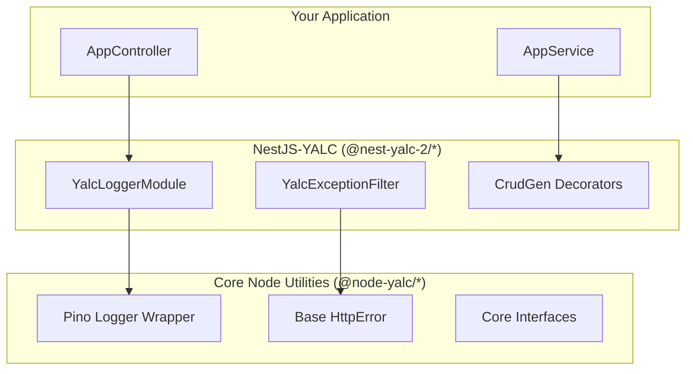

# Architecture

NestJS-YALC is structured as a modular monorepo, providing a bridge between raw Node.js utilities and the NestJS dependency injection system.

## The Bridge Pattern

At its core, NestJS-YALC acts as an adapter layer over [`@node-yalc`](/docs/node-yalc/overview). While [`@node-yalc`](/docs/node-yalc/overview) provides pure TypeScript/Node.js classes and functions (like loggers, error types, and generic event emitters), `@nest-yalc-2` wraps these into NestJS paradigms:

- **Providers (`@Injectable`)**: Core utilities are exposed as injectable services.
- **Dynamic Modules**: Configurations are passed via `.forRoot()` or `.forRootAsync()` patterns.
- **Interceptors & Filters**: Generic error types from [`@node-yalc`](/docs/node-yalc/overview) are caught and mapped to proper HTTP/GraphQL responses via NestJS Exception Filters.

## Module Taxonomy

NestJS-YALC modules can be categorized into three main layers:

### 1. Infrastructure Layer
Modules that deal with the underlying system and external boundaries.
- `@nest-yalc-2/logger`
- `@nest-yalc-2/observability`
- `@nest-yalc-2/errors`
- `@nest-yalc-2/sentinel`

### 2. Data & Persistence Layer
Modules that handle data storage, retrieval, and mapping.
- `@nest-yalc-2/database`
- `@nest-yalc-2/crud-gen`
- `@nest-yalc-2/data-loader`
- `@nest-yalc-2/audit`

### 3. Communication Layer
Modules that handle inter-service communication and APIs.
- `@nest-yalc-2/graphql`
- `@nest-yalc-2/api-strategy`
- `@nest-yalc-2/kafka`
- `@nest-yalc-2/event-manager`

## Workspace Organization

The repository relies on standard npm/yarn workspaces (or tools like Turborepo/Nx, depending on your setup) to manage the internal dependencies between `@nest-yalc-2/` packages. When building an application, you should depend on the specific packages rather than the entire collection to keep your bundle size minimal.
