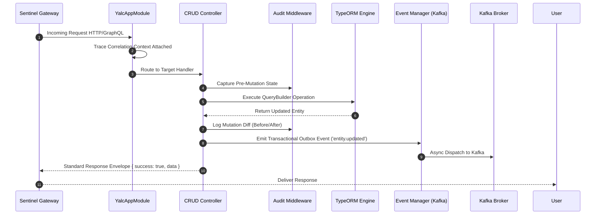

# Introduction & Ecosystem Architecture

Welcome to **NestJS-YALC** (*Yet Another Layer of Convenience for NestJS*), the enterprise-grade foundation framework for building scalable, high-performance microservices and monorepo applications in TypeScript and Node.js.

---

## 1. What It Is & Architectural Purpose

NestJS is an exceptional framework for structuring enterprise backend applications. However, when building distributed monorepos across multiple teams, developers spend hundreds of hours re-implementing core infrastructure: datagrid filter parsers, Avro/JSON Kafka deserializers, GraphQL federation directives, sentinel security headers, audit logging pipelines, and TypeORM connection lifecycle managers.

**NestJS-YALC** bridges this gap by offering a cohesive suite of modular packages that extend NestJS with battle-tested enterprise primitives. It provides standardized patterns that promote maintainability, strict security compliance, and zero-boilerplate development.

```
┌────────────────────────────────────────────────────────────────────────────────────────┐
│                                   YOUR ENTERPRISE APP                                  │
├────────────────────────────────────────────────────────────────────────────────────────┤
│  AG-Grid  │  CRUD-Gen  │  Audit Log  │  Sentinel Sec  │  Kafka Bus  │  GraphQL DataLoader │
├───────────┴────────────┴─────────────┴────────────────┴─────────────┴────────────────────┤
│                                    NESTJS-YALC KERNEL                                  │
├────────────────────────────────────────────────────────────────────────────────────────┤
│                                   NestJS Core (Express / Fastify)                      │
└────────────────────────────────────────────────────────────────────────────────────────┘
```

---

## 2. Monorepo Package Ecosystem Breakdown

| Package | Purpose & Domain | Key Feature |
| :--- | :--- | :--- |
| **`@nestjs-yalc/ag-grid`** | Server-side data grid handling | Automated TypeORM `QueryBuilder` filter & sort translation. |
| **`@nestjs-yalc/app`** | Application bootstrap kernel | Automated shutdown hooks, global exception bouncers, logger. |
| **`@nestjs-yalc/api-strategy`** | Response wrapping & versioning | Standardized `{ success, data, meta }` response envelopes. |
| **`@nestjs-yalc/audit`** | Audit trail & change tracking | Entity mutation diff logging with user context retention. |
| **`@nestjs-yalc/crud-gen`** | Automated CRUD API generation | Auto-generates REST/GraphQL CRUD routes from entity schemas. |
| **`@nestjs-yalc/data-loader`** | GraphQL DataLoader helper | Eliminates N+1 query problems automatically in TypeORM. |
| **`@nestjs-yalc/database`** | Multi-tenant TypeORM engine | Dynamic database connection pooling & migration runner. |
| **`@nestjs-yalc/errors`** | Enterprise HTTP/RPC exceptions | Unified error code taxonomy with localized messages. |
| **`@nestjs-yalc/event-manager`** | Local & distributed event bus | Hybrid in-memory EventEmitter2 + Kafka event outbox. |
| **`@nestjs-yalc/field-middleware`**| Property access control & masking | GraphQL field-level masking & encryption decorators. |
| **`@nestjs-yalc/graphql`** | GraphQL Federation & Utilities | Schema stitching, custom scalars, and Mercurius transport. |
| **`@nestjs-yalc/jest`** | Testing utilities & mockers | Automated DB sandbox factories & mock repository providers. |
| **`@nestjs-yalc/kafka`** | High-throughput messaging | Avro/JSON schema registry, DLQ retry routing, producer pool. |
| **`@nestjs-yalc/logger`** | Structured JSON logging | High-performance Pino logger with trace ID injection. |
| **`@nestjs-yalc/observability`** | Telemetry & Health Monitoring | Prometheus metrics export & OpenTelemetry trace propagation. |
| **`@nestjs-yalc/sentinel`** | Edge security & bouncer | CSP header protection, payload bouncer, CORS regex matchers. |
| **`@nestjs-yalc/utils`** | Shared utilities & queue pool | `runConcurrently()` queue, deep object sanitizers. |

---

## 3. Core Architectural Philosophy

### 1. Zero Boilerplate Code
Standardize repetitive operational routines (error mapping, logger initialization, request correlation tracking) into single-line module imports.

### 2. Strict Type Safety
All packages enforce strict TypeScript contracts. From AG-Grid filter models to Kafka message payloads, raw `any` types are strictly prohibited.

### 3. High Performance & Low Overhead
Built on top of Fastify, Pino, and native SQL query building, NestJS-YALC introduces minimal runtime overhead while preventing common memory leaks.

---

## 4. Architectural Sequence Flow



---

## 5. Next Steps

- Proceed to the [Quickstart Guide](quickstart.md) to bootstrap your first NestJS-YALC microservice.
- Explore individual package guides in the **Monorepo Modules** section.
