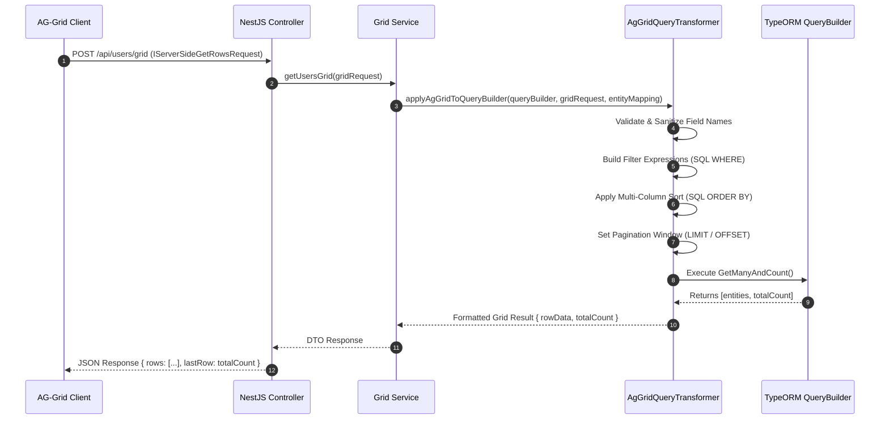

# AG-Grid Server-Side Integration & Query Transformers

The `@nestjs-yalc/ag-grid` package provides enterprise-grade, server-side data grid processing for NestJS applications. It automatically translates frontend AG-Grid request payloads (containing complex filtering rules, multi-column sorting, pagination limits, and grouping expressions) into optimized TypeORM `SelectQueryBuilder` execution plans with parameterized SQL generation.

---

## 1. What It Is & Architectural Purpose

Modern enterprise applications require rendering massive datasets (millions of rows) with real-time grid capabilities—such as column searching, multi-level sorting, dynamic range filtering, and server-side pagination—without overwhelming client-side memory or making un-indexed database calls.

`@nestjs-yalc/ag-grid` acts as the bridge between frontend AG-Grid Enterprise implementations and backend TypeORM ORM layers. It eliminates hand-written SQL search parsers by consuming standard AG-Grid `IServerSideGetRowsRequest` structures and applying exact column-mapping logic, type-safe conversions, and automated security sanitization before database execution.

```
┌────────────────────────┐      AG-Grid JSON Payload      ┌─────────────────────────────┐
│                        │ ─────────────────────────────> │                             │
│  Frontend AG-Grid      │                                │  AG-Grid Transformer        │
│  (Server-Side Model)   │ <───────────────────────────── │  (@nestjs-yalc/ag-grid)     │
└────────────────────────┘      Row Data + Total Count    └──────────────┬──────────────┘
                                                                         │
                                                                         │ TypeORM SQL Builder
                                                                         ▼
                                                          ┌─────────────────────────────┐
                                                          │  PostgreSQL / MySQL / SQLite │
                                                          └─────────────────────────────┘
```

---

## 2. What It Does & Key Capabilities

- **Automated Filter Translation**: Converts AG-Grid text, number, date, set, and boolean filter models into parameterized SQL `WHERE` clauses.
- **Multi-Column Sorting**: Translates nested `sortModel` arrays into SQL `ORDER BY` statements with null-sorting safety.
- **Dynamic Pagination**: Calculates offset-based (`SKIP` / `TAKE`) parameters directly from `startRow` and `endRow`.
- **Column Mapping & Security Sanitization**: Maps grid field keys to actual entity properties or joined table aliases while stripping SQL injection vectors.
- **Relational Field Resolution**: Supports deeply nested column paths (e.g., `user.profile.firstName`) across TypeORM `LEFT JOIN` aliases.

---

## 3. How It Works Under the Hood

### Execution Flow Sequence



### Internal Engine Mechanics

1. **Filter Model Parsing**: When a filter request arrives (e.g., `filterType: 'number', type: 'greaterThan', filter: 100`), the `AgGridQueryTransformer` inspects the registered entity metadata. It converts the operator into parameterized SQL (`field > :param_1`) to prevent SQL injection.
2. **Date Range Normalization**: Date filters automatically cast ISO-8601 strings into database-compatible timestamps and apply boundary ranges (`BETWEEN` or `>=` and `<=`).
3. **Set Filters (`IN` Clauses)**: Multi-selection set filters convert array values into parameterized `IN (:...setValues)` conditions.

---

## 4. Why It Was Designed This Way

| Design Aspect | Traditional Hand-Coded Approach | @nestjs-yalc/ag-grid Approach |
| :--- | :--- | :--- |
| **Maintenance** | Writing manual SQL `WHERE` parsers for every API endpoint. | Single decorator / service call handles any complex grid query. |
| **Security** | High risk of SQL injection via unescaped search string concatenation. | 100% Parameterized queries with column-name whitelist validation. |
| **Performance** | Inefficient table scans from non-indexed dynamic joins. | Strict relation aliasing with indexed column mapping rules. |
| **Type Safety** | Loose `any` typing for grid filter parameters. | Strictly typed DTO wrappers for `IServerSideGetRowsRequest`. |

---

## 5. Practical Usage Guide & Extended Code Examples

### 5.1 Basic Controller & Service Setup

```typescript
import { Controller, Post, Body } from '@nestjs/common';
import { InjectRepository } from '@nestjs/typeorm';
import { Repository } from 'typeorm';
import { AgGridQueryTransformer, IServerSideGetRowsRequest } from '@nestjs-yalc/ag-grid';
import { UserEntity } from './user.entity';

@Controller('users')
export class UserController {
  constructor(
    @InjectRepository(UserEntity)
    private readonly userRepository: Repository<UserEntity>,
  ) {}

  @Post('grid')
  async getUsersGrid(@Body() gridRequest: IServerSideGetRowsRequest) {
    const queryBuilder = this.userRepository.createQueryBuilder('user');

    // Apply AG-Grid filters, sorting, and pagination
    const transformer = new AgGridQueryTransformer<UserEntity>(queryBuilder, gridRequest, {
      id: 'user.id',
      email: 'user.email',
      role: 'user.role',
      createdAt: 'user.createdAt',
      'department.name': 'department.name', // Relational field mapping
    });

    // Automatically adds LEFT JOIN if relational fields are filtered/sorted
    transformer.applyJoins([
      { property: 'user.department', alias: 'department' }
    ]);

    const [rows, totalCount] = await transformer.execute();

    return {
      rows,
      lastRow: totalCount,
    };
  }
}
```

### 5.2 Advanced Custom Filter Handling

```typescript
import { AgGridQueryTransformer, FilterCondition } from '@nestjs-yalc/ag-grid';

const transformer = new AgGridQueryTransformer(queryBuilder, gridRequest, fieldMap);

// Register custom filter evaluator for complex JSONB or GEO columns
transformer.registerCustomFilter('metadata', (qb, filterModel: FilterCondition) => {
  qb.andWhere("user.metadata ->> 'status' = :status", { status: filterModel.filter });
});

const result = await transformer.execute();
```

---

## 6. Anti-Patterns: How NOT to Use It

> [!CAUTION]
> **Anti-Pattern 1: Passing Raw Unmapped Frontend Fields**
> Never pass client-provided field names directly into the QueryBuilder without validating them against an explicit field mapping object. Doing so allows malicious clients to probe private database columns.

```typescript
// ❌ WRONG: Passing unmapped grid field directly
queryBuilder.orderBy(gridRequest.sortModel[0].colId);

// ✅ CORRECT: Use AgGridQueryTransformer field map
const transformer = new AgGridQueryTransformer(queryBuilder, gridRequest, {
  allowedField: 'entity.actualColumn',
});
```

> [!WARNING]
> **Anti-Pattern 2: Unbounded Count Queries on Large Tables**
> Calling `getManyAndCount()` on tables with tens of millions of rows without indexes can freeze database workers. Always pass pre-filtered indexing constraints or set maximum `take` limits.

---

## 7. Pro-Tips & Best Practices

> [!TIP]
> **Optimization 1: Indexing Strategy**
> Create composite indexes on frequently filtered and sorted column combinations (e.g., `(department_id, created_at DESC)`).

> [!NOTE]
> **Optimization 2: Default Sort Order**
> Always provide a fallback default sort order (e.g., `user.id DESC`) in case the user clears all grid sorts, ensuring deterministic SQL pagination results.
