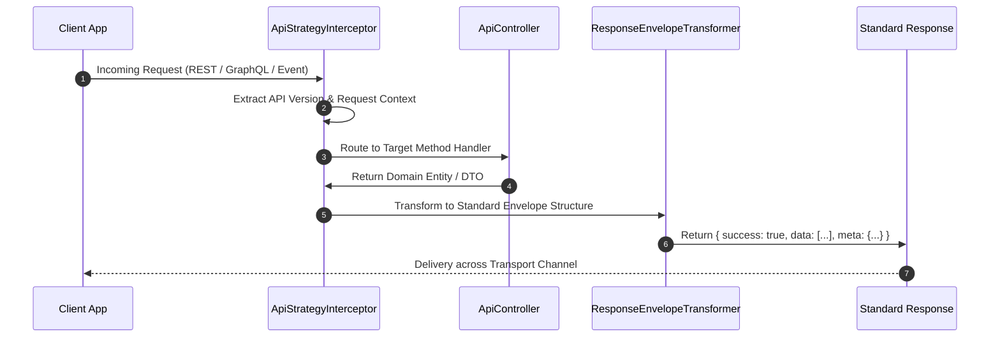

# API Strategy, Multi-Protocol Adapters & Contract Versioning

The `@nestjs-yalc/api-strategy` package enforces standardized API design paradigms across REST, GraphQL, and Messaging protocols. It provides multi-protocol controller abstractions, automated URI versioning strategies, uniform response payload wrapping, and content-negotiation adapters.

---

## 1. What It Is & Architectural Purpose

In complex microservice ecosystems, frontends and third-party integrations interact with backend services across multiple protocols (REST endpoints, GraphQL queries/mutations, gRPC calls, and Kafka/RabbitMQ events). Without a unified API strategy, response formats become fragmented, error payloads vary per protocol, and breaking API changes disrupt client compatibility.

`@nestjs-yalc/api-strategy` provides a cohesive architectural abstraction layer. It ensures that regardless of whether a controller method is invoked via HTTP GET, GraphQL Query, or AMQP Message, the incoming DTO validation, context propagation, error mapping, and response envelopes follow identical enterprise standards.

```
                               ┌─────────────────────────────┐
                               │  @nestjs-yalc/api-strategy  │
                               └──────────────┬──────────────┘
                                              │
           ┌──────────────────────────────────┼──────────────────────────────────┐
           │                                  │                                  │
           ▼                                  ▼                                  ▼
┌─────────────────────┐            ┌─────────────────────┐            ┌─────────────────────┐
│  REST API Adapter   │            │ GraphQL API Adapter │            │  Event API Adapter  │
│  (/api/v1/users)    │            │ (Queries/Mutations) │            │ (Kafka / RabbitMQ)  │
└─────────────────────┘            └─────────────────────┘            └─────────────────────┘
```

---

## 2. What It Does & Key Capabilities

- **Unified Response Envelopes**: Wraps all API responses in standardized `{ statusCode, success, data, errors, meta }` payloads.
- **URI & Header Versioning**: Provides `@ApiVersion('v1')` decorators supporting URI path versioning (`/v1/...`), header versioning (`x-api-version`), and media-type negotiation.
- **Multi-Protocol Controller Decorators**: Provides `@YalcController()` and `@YalcResolver()` decorators that automatically attach correlation context and rate-limiting rules.
- **Pagination & Sorting Normalization**: Standardizes request DTO contracts for limit/page offset and cursor-based pagination parameters.

---

## 3. How It Works Under the Hood

### Request Pipeline Sequence



---

## 4. Why It Was Designed This Way

| Metric / Scenario | Standard NestJS Rest | @nestjs-yalc/api-strategy |
| :--- | :--- | :--- |
| **Response Uniformity** | Controllers return raw arrays or plain objects inconsistently. | Every response is wrapped in a type-safe `{ success, data, meta }` envelope. |
| **Protocol Parity** | REST and GraphQL controllers require duplicate mapping logic. | Shared domain handler logic across REST, GraphQL, and RPC transports. |
| **API Deprecation** | Hardcoded route strings break when upgrading API major versions. | Automated path/header version resolution with `@ApiVersion()`. |

---

## 5. Practical Usage Guide & Extended Code Examples

### 5.1 Standard REST Controller with Unified Response Envelope

```typescript
import { Controller, Get, Param, Query } from '@nestjs/common';
import { ApiVersion, YalcController, ResponseEnvelope } from '@nestjs-yalc/api-strategy';
import { UserService } from './user.service';
import { UserDto } from './user.dto';

@YalcController({ path: 'users', version: '1' })
export class UserController {
  constructor(private readonly userService: UserService) {}

  @Get(':id')
  @ApiVersion('1')
  async getUserById(@Param('id') id: string): Promise<ResponseEnvelope<UserDto>> {
    const user = await this.userService.findById(id);
    return ResponseEnvelope.success(user, { cached: true });
  }
}
```

### 5.2 Multi-Protocol Service Handler Example

```typescript
import { Injectable } from '@nestjs/common';
import { BaseApiStrategyService, PaginationDto } from '@nestjs-yalc/api-strategy';
import { UserEntity } from './user.entity';

@Injectable()
export class UserApiStrategyService extends BaseApiStrategyService<UserEntity> {
  async fetchPaginatedUsers(pagination: PaginationDto) {
    const [data, total] = await this.repository.findAndCount({
      skip: pagination.skip,
      take: pagination.take,
    });

    return this.createPaginatedResponse(data, total, pagination);
  }
}
```

---

## 6. Anti-Patterns: How NOT to Use It

> [!CAUTION]
> **Anti-Pattern 1: Returning Naked Objects in Controllers**
> Bypassing the `ResponseEnvelope` wrapper by returning raw database entities exposes internal DB schemas directly to clients and breaks client SDK deserializers.

```typescript
// ❌ WRONG: Naked entity return
@Get()
async getUsers() { return this.userRepository.find(); }

// ✅ CORRECT: Wrapped in ResponseEnvelope
@Get()
async getUsers() {
  const users = await this.userRepository.find();
  return ResponseEnvelope.success(users);
}
```

---

## 7. Pro-Tips & Best Practices

> [!TIP]
> **Pro-Tip 1: Automated Swagger Schema Generation**
> When using `@YalcController()`, OpenApi schema documentation is automatically generated for both successful payload envelopes and standardized error models.
