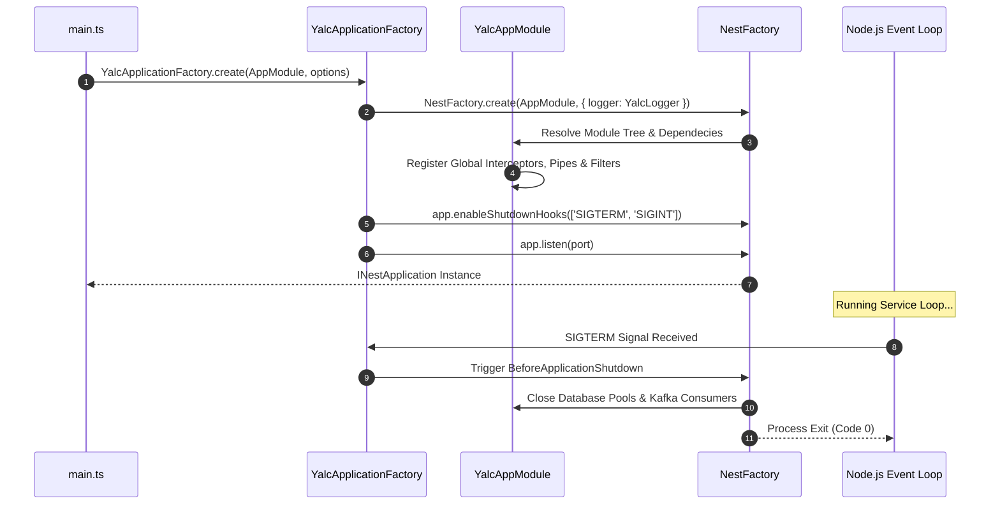

# Application Lifecycle, Bootstrap & Module Composition

The `@nestjs-yalc/app` module provides a standardized, enterprise-ready application bootstrapping kernel for NestJS microservices and monolithic servers. It abstracts boilerplate startup routines—such as graceful shutdown signal handlers, unified configuration loading, global interceptors/filters registration, health-check lifecycle hooks, and multi-tenant context injection.

---

## 1. What It Is & Architectural Purpose

In enterprise NestJS architectures, microservices often duplicate complex bootstrapping logic across repositories: setting up CORS, configuring global validation pipes, registering custom exception filters, wiring up OpenTelemetry tracing, and managing graceful shutdown signals (SIGTERM / SIGINT).

`@nestjs-yalc/app` encapsulates these cross-cutting bootstrap concerns into a declarative `YalcApplicationFactory` and `YalcAppModule`. It ensures every service within the monorepo adheres to identical security, observability, and lifecycle standards out of the box.

```
┌────────────────────────────────────────────────────────────────────────┐
│                        YalcApplicationFactory                          │
├────────────────────────────────────────────────────────────────────────┤
│  1. Init Global Logger (Pino / Winston)                                │
│  2. Attach OpenTelemetry Tracing Context                              │
│  3. Register Global ValidationPipes & ExceptionFilters                 │
│  4. Mount Sentinel Security Headers & CORS                             │
│  5. Setup Graceful Shutdown Listeners (SIGTERM/SIGINT)                 │
└──────────────────────────────────┬─────────────────────────────────────┘
                                   │
                                   ▼
┌────────────────────────────────────────────────────────────────────────┐
│                         NestJS Express / Fastify                       │
└────────────────────────────────────────────────────────────────────────┘
```

---

## 2. What It Does & Key Capabilities

- **Unified Application Factory**: Provides `YalcApplicationFactory.create()` to initialize HTTP, GraphQL, or RPC microservice instances with zero boilerplate.
- **Automated Lifecycle Hooks**: Hooks into NestJS `OnModuleInit`, `OnApplicationBootstrap`, `OnModuleDestroy`, and `BeforeApplicationShutdown` lifecycle events to manage database connection pools, Kafka consumers, and background queue workers safely.
- **Global Context Middleware**: Injects correlation IDs (`x-correlation-id`) and request tracking tokens into AsyncLocalStorage across all incoming requests.
- **Graceful Shutdown Engine**: Ensures active HTTP connections finish processing and message queues drain before the process exits.

---

## 3. How It Works Under the Hood

### Application Bootstrap Sequence



---

## 4. Why It Was Designed This Way

| Feature | Standard NestJS Bootstrap | @nestjs-yalc/app Kernel |
| :--- | :--- | :--- |
| **Boilerplate** | 100+ lines of duplicate `main.ts` setup in every microservice. | Single call to `YalcApplicationFactory.create()`. |
| **Shutdown Safety** | Default NestJS requires explicit `enableShutdownHooks()`. | Built-in async resource cleanup and connection pool draining. |
| **Configuration** | Hand-rolled `ConfigService` bindings scattered across modules. | Centralized configuration validation with dotenv and Vault support. |
| **Error Hardening** | Unhandled promise rejections can crash worker processes silently. | Global uncaught exception bouncers with structured error logging. |

---

## 5. Practical Usage Guide & Extended Code Examples

### 5.1 Standard `main.ts` Application Setup

```typescript
import { YalcApplicationFactory } from '@nestjs-yalc/app';
import { AppModule } from './app.module';

async function bootstrap() {
  const app = await YalcApplicationFactory.create(AppModule, {
    appName: 'user-service',
    port: 3000,
    cors: {
      origin: ['https://example.com'],
      credentials: true,
    },
    swagger: {
      enabled: true,
      path: '/api/docs',
      title: 'User Service API',
      version: '1.0.0',
    },
    gracefulShutdownTimeoutMs: 10000,
  });

  await app.listen();
}

bootstrap();
```

### 5.2 Declarative `YalcAppModule` Definition

```typescript
import { Module } from '@nestjs/common';
import { YalcAppModule } from '@nestjs-yalc/app';
import { DatabaseModule } from '@nestjs-yalc/database';
import { LoggerModule } from '@nestjs-yalc/logger';
import { UserModule } from './user/user.module';

@Module({
  imports: [
    YalcAppModule.forRoot({
      isGlobal: true,
      envFilePath: ['.env.local', '.env'],
    }),
    LoggerModule.forRoot({ serviceName: 'user-service' }),
    DatabaseModule.forRoot(),
    UserModule,
  ],
})
export class AppModule {}
```

---

## 6. Anti-Patterns: How NOT to Use It

> [!CAUTION]
> **Anti-Pattern 1: Bypassing the YalcApplicationFactory**
> Directly calling `NestFactory.create()` in `main.ts` bypasses global correlation tracking, centralized error filters, and graceful shutdown handlers, causing trace breaks in production.

```typescript
// ❌ WRONG: Standard NestFactory skips yalc enterprise middleware
const app = await NestFactory.create(AppModule);

// ✅ CORRECT: Use YalcApplicationFactory
const app = await YalcApplicationFactory.create(AppModule, options);
```

> [!WARNING]
> **Anti-Pattern 2: Blocking the Bootstrap Loop**
> Performing heavy CPU-bound computations or synchronous HTTP calls inside `onModuleInit()` blocks the NestJS dependency graph initialization. Always use non-blocking asynchronous promises.

---

## 7. Pro-Tips & Best Practices

> [!TIP]
> **Pro-Tip 1: Health Check Binding**
> Register custom liveness and readiness health indicators via `@nestjs-yalc/app` to integrate directly with Kubernetes `/healthz` and `/readyz` probes.

> [!NOTE]
> **Pro-Tip 2: Multi-Environment Config Profiles**
> Pass `envFilePath` arrays to automatically overlay target environments (`.env.production`, `.env.staging`, `.env.local`) cleanly.
