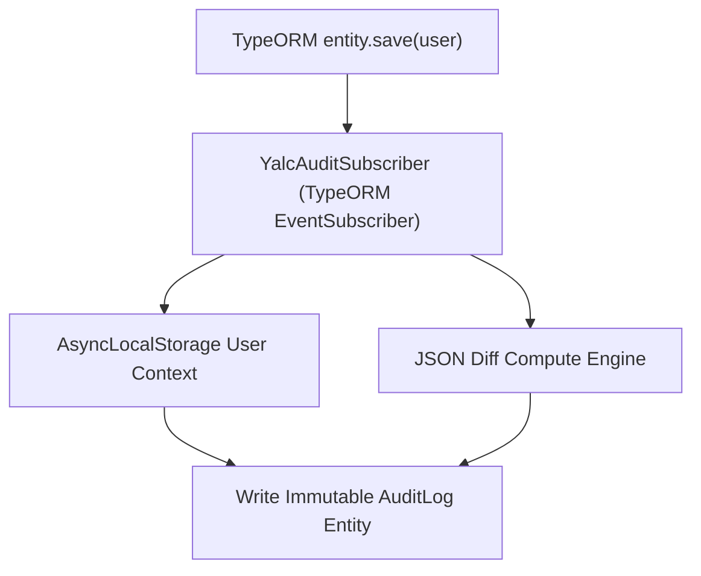

# 📋 Compliance Entity Auditing (`@nest-yalc-2/audit`)

`@nest-yalc-2/audit` provides enterprise compliance entity auditing and revision tracking for NestJS 11+. It automatically intercepts TypeORM entity mutation operations (`INSERT`, `UPDATE`, `DELETE`), capturing before/after field diffs and correlating mutations with the active authenticated user ID.

---

## 🌟 Key Features

- **Automated Entity Lifecycle Subscribers**: Automatically intercepts TypeORM entity updates without requiring manual trigger code.
- **User Identity Correlation**: Retrieves the active user ID from request context (AsyncLocalStorage) and attaches it to the revision log.
- **Before / After JSON Diffs**: Computes and stores granular field-level changes (`previousValue` vs `newValue`).
- **Compliance Ready (SOC 2 / GDPR / HIPAA)**: Produces append-only immutable audit trail tables suitable for regulatory audits.

---

## 🔬 Internal Architecture & Execution Mechanics



---

## 📊 Architectural Comparison: `@nest-yalc-2/audit` vs Manual Entity Listeners

| Feature / Dimension | 📋 `@nest-yalc-2/audit` | 🐢 Manual TypeORM Listeners |
|---|---|---|
| **User Identity Binding** | **Automatic (`AsyncLocalStorage` User Context)** | Requires passing `user` parameter to Service |
| **Field-Level Diff Generation** | **Automated JSON Field Diffs** | Manual Property-by-Property Comparison |
| **Audit Table Immutability** | **Append-Only Immutable Schema** | Manual Table Creation |

---

## 🚀 Practical Usage & Production Code Examples

### 1. Registering Audit Module in `AppModule`

```typescript
import { Module } from '@nestjs/common';
import { YalcAuditModule } from '@nest-yalc-2/audit';

@Module({
  imports: [
    YalcAuditModule.forRoot({
      enabledEntities: ['User', 'Order', 'Product'],
      auditTableName: 'system_audit_logs',
    }),
  ],
})
export class AppModule {}
```

### 2. Querying Audit History for an Entity

```typescript
import { Injectable } from '@nestjs/common';
import { YalcAuditService } from '@nest-yalc-2/audit';

@Injectable()
export class UserAuditController {
  constructor(private readonly auditService: YalcAuditService) {}

  async getUserRevisionHistory(userId: string) {
    // Returns full audit trail of changes for the specified User entity ID
    return await this.auditService.findLogsForEntity('User', userId);
  }
}
```

---

## ⚠️ Common Pitfalls & Anti-Patterns

> [!CAUTION]
> **Modifying Audit Log Records**: Audit log tables must remain strictly append-only. Never expose `UPDATE` or `DELETE` endpoints for audit records.

---

## 💡 Best Practices

> [!TIP]
> **Archiving Historical Audits**: Move audit logs older than 90 days to Amazon S3 Glacier or cold storage using automated database partitioning to keep primary database tables lean.
