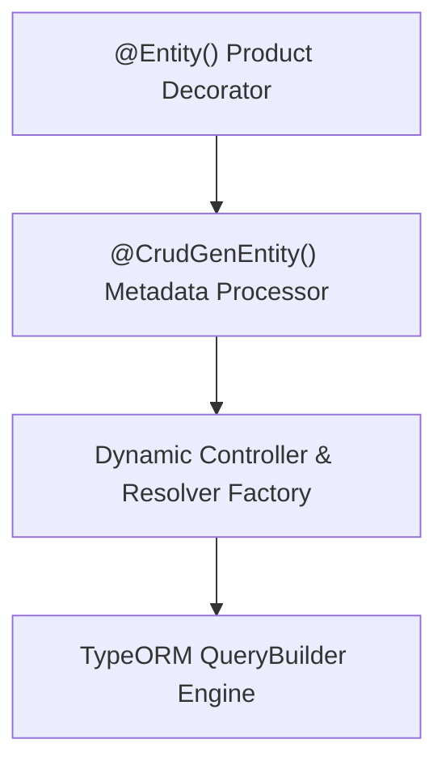

# ⚡ Zero-Boilerplate TypeORM CRUD Generator (`@nest-yalc-2/crud-gen`)

## 💡 1. What It Is & Architectural Purpose
`@nest-yalc-2/crud-gen` is the automated REST and GraphQL code generation module for NestJS 11+. It was designed to eliminate up to 40% of repetitive controller, resolver, service, DTO, and query builder boilerplate for TypeORM database entities, while maintaining full developer control over authorization and middleware.

---

## ⚙️ 2. What It Does & Key Features
- **Automated REST Endpoints**: Generates `getMany`, `getOne`, `createOne`, `updateOne`, `deleteOne` endpoints automatically.
- **Automated GraphQL Queries & Mutations**: Produces strongly-typed GraphQL schemas, input DTOs, and field resolvers.
- **Dynamic SQL Query Parsing**: Translates HTTP query strings (e.g. `filter[age][gte]=18&sort=-createdAt`) into optimized TypeORM `WHERE`, `ORDER BY`, and `JOIN` clauses.
- **Pagination Support**: Automatic cursor-based or offset-based pagination.

---

## 🔬 3. How It Works Under the Hood



1. **Metadata Reflection**: Decorating a TypeORM entity with `@CrudGenEntity()` registers entity metadata and route configuration choices.
2. **Dynamic Factory Pattern**: On NestJS application bootstrap, the `crud-gen` factory dynamically instantiates REST controllers and GraphQL resolvers with dependency injection into TypeORM repositories.

---

## 🧠 4. Why It Was Designed This Way (CrudGen vs Manual Scaffolding)

| Dimension | ⚡ `@nest-yalc-2/crud-gen` | 🐢 Manual NestJS Scaffolding |
|---|---|---|
| **Endpoint Setup Time** | **< 2 minutes per Entity** | 2-4 hours per Entity |
| **Maintainability** | **Centralized (Modify Entity to Update API)** | Dozens of files to sync (DTO, Service, Controller, Resolver) |
| **Dynamic Filtering** | **Native SQL Query Filtering Support** | Requires Handwritten QueryBuilder Logic |

---

## 🚀 5. Practical Usage Guide & Extended Code Examples

```typescript
import { Entity, PrimaryGeneratedColumn, Column, CreateDateColumn } from 'typeorm';
import { CrudGenEntity } from '@nest-yalc-2/crud-gen';

@Entity('products')
@CrudGenEntity({
  routes: ['getMany', 'getOne', 'createOne', 'updateOne', 'deleteOne'],
  graphql: { enabled: true }
})
export class Product {
  @PrimaryGeneratedColumn('uuid')
  id: string;

  @Column()
  sku: string;

  @Column()
  name: string;

  @Column('decimal', { precision: 10, scale: 2 })
  price: number;

  @CreateDateColumn()
  createdAt: Date;
}
```

---

## ⚠️ 6. Anti-Patterns: How NOT to Use It

1. ❌ **DO NOT expose all CRUD routes on sensitive entities without Auth Guards**: Enabling `deleteOne` or `updateOne` without applying `@UseGuards()` exposes public data mutation endpoints.
2. ❌ **DO NOT use `crud-gen` for complex business workflows requiring Sagas**: For operations involving payment providers or multi-step sagas, write a custom Controller/Resolver instead of standard CRUD logic.

---

## 💡 7. Pro-Tips & Best Practices

> [!TIP]
> **Customizing Generated Routes**: You can override or extend any automatically generated route by declaring a custom Controller extending the base class produced by `crud-gen`.
