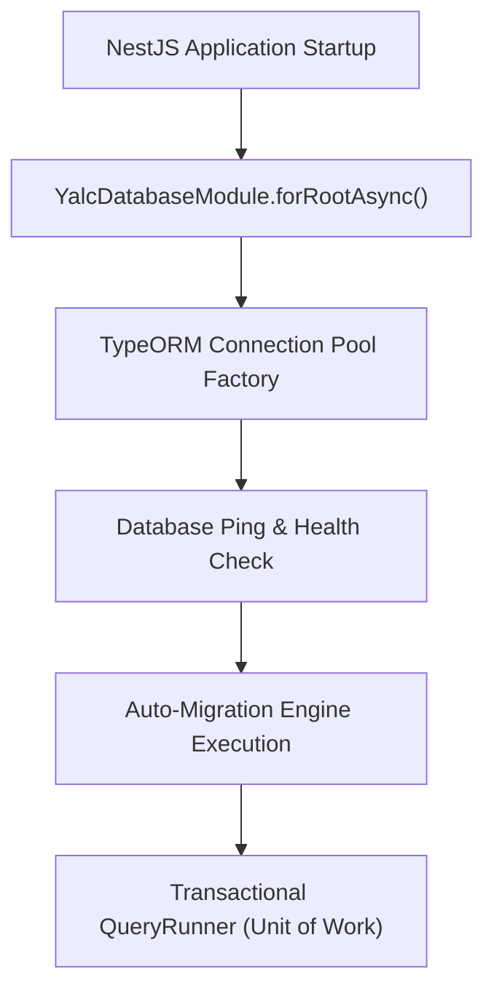

# 🗄️ Multi-Database & Transactional Repositories (`@nest-yalc-2/database`)

`@nest-yalc-2/database` is the enterprise persistence infrastructure module for NestJS 11+. It provides dynamic multi-database connection management, transactional repository runners, automated database migrations, and entity seeding helpers powered by TypeORM and `@node-yalc`.

---

## 🌟 Key Features

- **Multi-Database Connection Factories**: Dynamically initializes and manages separate TypeORM connections (MySQL, PostgreSQL, MariaDB, SQLite, MSSQL) within the same NestJS application.
- **Transactional Repository Runners**: Manages database transactions automatically using Unit of Work patterns, ensuring atomic execution across multiple entity repositories.
- **Automatic Migration Engine**: Discovers, validates, and runs database migration scripts on application startup.
- **Database Seeding Helpers**: Integrates `@jorgebodega/typeorm-seeding` to populate test and staging environments with mock data generators.

---

## 🔬 Internal Architecture & Execution Mechanics



### Transaction Execution Pipeline
1. **QueryRunner Allocation**: When executing a transactional operation via `YalcDatabaseService.runInTransaction()`, the module obtains a dedicated TypeORM `QueryRunner` from the connection pool.
2. **Transaction Isolation**: Starts a database transaction with configurable isolation levels (`READ COMMITTED`, `SERIALIZABLE`).
3. **Automatic Rollback**: If any error or domain exception (`AppError`) is thrown inside the transaction callback, the runner issues a `ROLLBACK` command immediately and releases the connection back to the pool.

---

## 📊 Architectural Comparison: `@nest-yalc-2/database` vs Standard TypeORM

| Feature / Dimension | 🗄️ `@nest-yalc-2/database` | 🐢 Standard NestJS TypeORM Module |
|---|---|---|
| **Multi-Database Management** | **Dynamic Factory with Connection Pooling** | Manual Connection Naming & Injection |
| **Transaction Execution** | **Atomic `runInTransaction()` Runner** | Manual `queryRunner.startTransaction()` |
| **Error Handling in Transactions** | **Auto-Rollback on `@node-yalc/errors`** | Manual `try/catch/rollback` Boilerplate |
| **Entity Seeding Integration** | **Native Seeder Factories** | External Custom Scripts |

---

## 🚀 Practical Usage & Production Code Examples

### 1. Registering Database Module in `AppModule`

```typescript
import { Module } from '@nestjs/common';
import { YalcDatabaseModule } from '@nest-yalc-2/database';
import { ConfigService } from '@nestjs/config';

@Module({
  imports: [
    YalcDatabaseModule.forRootAsync({
      useFactory: (config: ConfigService) => ({
        type: 'postgres',
        host: config.get<string>('DB_HOST', 'localhost'),
        port: config.get<number>('DB_PORT', 5432),
        username: config.get<string>('DB_USER', 'postgres'),
        password: config.get<string>('DB_PASS', 'secret'),
        database: config.get<string>('DB_NAME', 'enterprise_db'),
        autoLoadEntities: true,
        synchronize: false, // Always false in production!
        migrationsRun: true,
        extra: {
          max: 20, // Connection pool size
          idleTimeoutMillis: 30000,
        },
      }),
      inject: [ConfigService],
    }),
  ],
})
export class AppModule {}
```

### 2. Executing Atomic Multi-Entity Transactions

```typescript
import { Injectable } from '@nestjs/common';
import { YalcDatabaseService } from '@nest-yalc-2/database';
import { User } from './entities/user.entity';
import { AuditLog } from './entities/audit-log.entity';

@Injectable()
export class UserManagementService {
  constructor(private readonly dbService: YalcDatabaseService) {}

  async createUserWithAudit(userData: Partial<User>, adminUserId: string): Promise<User> {
    // Execute atomic transaction across multiple entity repositories
    return await this.dbService.runInTransaction(async (entityManager) => {
      // 1. Save new User entity
      const userRepo = entityManager.getRepository(User);
      const newUser = userRepo.create(userData);
      const savedUser = await userRepo.save(newUser);

      // 2. Write Audit Log entry inside the SAME transaction
      const auditRepo = entityManager.getRepository(AuditLog);
      const auditEntry = auditRepo.create({
        action: 'USER_CREATED',
        targetEntityId: savedUser.id,
        performedBy: adminUserId,
        timestamp: new Date(),
      });
      await auditRepo.save(auditEntry);

      return savedUser;
    });
  }
}
```

---

## ⚠️ Common Pitfalls & Anti-Patterns

> [!CAUTION]
> **Anti-Pattern 1: Performing Long-Running Async HTTP Calls Inside Transactions**
> Never place slow external HTTP API calls or S3 file uploads inside `runInTransaction()`. Holding database transaction locks open while waiting for external network responses causes database connection pool exhaustion under load.

> [!WARNING]
> **Anti-Pattern 2: Using `synchronize: true` in Staging / Production Environments**
> Enabling TypeORM `synchronize: true` dynamically alters database schemas on application startup, which can inadvertently drop database columns or tables. Always set `synchronize: false` and use `@nest-yalc-2/database` migration scripts.

---

## 💡 Best Practices & Performance Tuning

> [!TIP]
> **Connection Pool Sizing**: Configure database connection pool sizes based on your container concurrency limits:
> `Pool Size = (CPU Cores x 2) + Effective Spindle Count`
