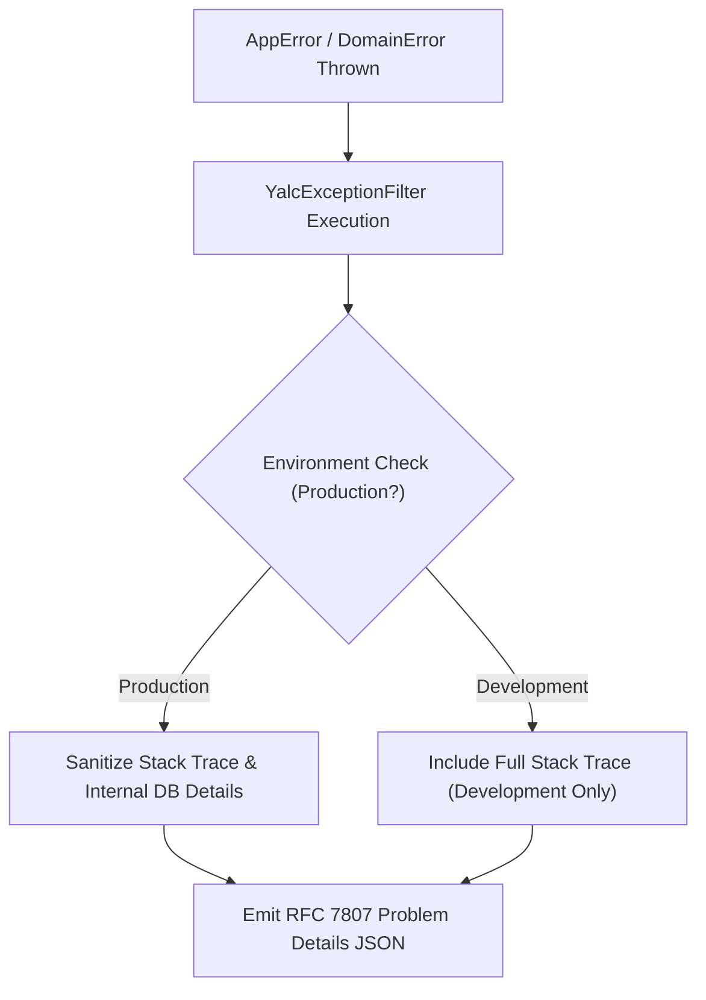

# ⚠️ Exception Filters & Error Mapping (`@nest-yalc-2/errors`)

`@nest-yalc-2/errors` provides standardized NestJS 11+ Exception Filters mapping `@node-yalc/errors` to RFC 7807 Problem Details HTTP and GraphQL error responses.

---

## 🌟 Key Features

- **Global Exception Filter (`YalcExceptionFilter`)**: Intercepts `@node-yalc/errors` and standard NestJS exceptions globally.
- **RFC 7807 Problem Details Compliance**: Formats HTTP error responses into standard `application/problem+json` structure.
- **Production Stack Trace Masking**: Masks internal stack trace details in production while preserving correlation IDs.
- **GraphQL Error Extension Mapping**: Formats Apollo and Mercurius GraphQL error extensions.

---

## 🔬 Internal Architecture & Execution Mechanics



---

## 📊 Architectural Comparison: `@nest-yalc-2/errors` vs Standard NestJS Filters

| Feature / Dimension | ⚠️ `@nest-yalc-2/errors` | 🐢 Default NestJS Exception Filter |
|---|---|---|
| **Response Format** | **RFC 7807 Problem Details Compliant** | Basic `{ statusCode, message, error }` |
| **Stack Trace Protection** | **Automated Production Masking** | Exposes Stack Traces if unhandled |
| **Trace ID Injection** | **Automatically attaches `X-Request-Id`** | Manual Formatting Required |

---

## 🚀 Practical Usage & Production Code Examples

### 1. Registering Global Exception Filter in `AppModule`

```typescript
import { Module } from '@nestjs/common';
import { APP_FILTER } from '@nestjs/core';
import { YalcExceptionFilter } from '@nest-yalc-2/errors';

@Module({
  providers: [
    {
      provide: APP_FILTER,
      useClass: YalcExceptionFilter,
    },
  ],
})
export class AppModule {}
```

### 2. Throwing Typed Errors in Business Services

```typescript
import { Injectable } from '@nestjs/common';
import { NotFoundError, ValidationError } from '@node-yalc/errors';

@Injectable()
export class AccountService {

  async findAccount(accountId: string) {
    if (!accountId) {
      throw new ValidationError('Account ID is required');
    }

    const account = null;
    if (!account) {
      throw new NotFoundError(`Account ${accountId} not found`, { accountId });
    }

    return account;
  }
}
```

---

## ⚠️ Common Pitfalls & Anti-Patterns

> [!CAUTION]
> **Catching Errors and Returning HTTP 200 OK**: Returning `200 OK` with `{ success: false, error: '...' }` inside response bodies breaks REST semantics, caches error responses in CDNs, and confuses API clients. Always throw typed exceptions mapped by `YalcExceptionFilter`.

---

## 💡 Best Practices

> [!TIP]
> **Client Request Correlation**: Include the returned `instance` trace ID when logging client-side errors to allow support engineers to locate the exact backend log line instantly.
