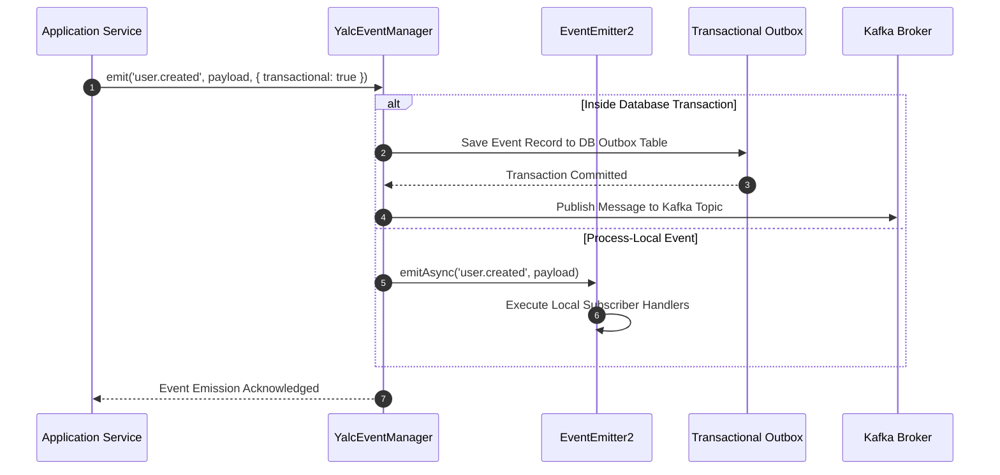

# In-Memory & Distributed Event Manager

The `@nestjs-yalc/event-manager` package provides a unified event bus for NestJS microservices. It bridges local, process-level event emitters (built on Node.js `EventEmitter2`) with external distributed messaging brokers (such as Apache Kafka and RabbitMQ), providing transactional event delivery, wildcard topic subscriptions, and type-safe payload dispatches.

---

## 1. What It Is & Architectural Purpose

Decoupled domain architectures rely on domain events (e.g., `UserCreatedEvent`, `OrderPaidEvent`) to trigger side effects without creating hard dependencies between modules. However, microservices often struggle with choosing between local in-process events (fast, non-persistent) and distributed message queues (durable, cross-service).

`@nestjs-yalc/event-manager` unifies local and distributed event processing under a single interface. Developers emit events without caring whether the handler is executed in the same process thread or consumed by another service via Kafka.

```
┌────────────────────────────────────────────────────────────────────────┐
│                        YalcEventManager                                │
├──────────────────────────────────┬─────────────────────────────────────┤
│  Local EventEmitter2             │  External Distributed Bridge        │
│  (In-Process Synchronous/Async) │  (Kafka / RabbitMQ Broker)          │
└────────────────┬─────────────────┴──────────────────┬──────────────────┘
                 │                                    │
                 ▼                                    ▼
┌─────────────────────────────────┐  ┌──────────────────────────────────┐
│ Local Subscriptions             │  │ External Microservices           │
│ (@OnEvent('user.created'))      │  │ (Topic: 'events.user.created')   │
└─────────────────────────────────┘  └──────────────────────────────────┘
```

---

## 2. What It Does & Key Capabilities

- **Unified Dispatch Interface**: Single `eventManager.emit()` method handles both local micro-tasks and distributed Kafka events.
- **Wildcard Topic Patterns**: Supports hierarchical event namespaces (`order.*`, `user.created.**`) powered by EventEmitter2.
- **Transactional Event Outbox**: Integrates with TypeORM database transactions to ensure events are only dispatched if the DB commit succeeds.
- **Type-Safe Payload Schemas**: Validates event payload DTOs at runtime before emitting to event consumers.

---

## 3. How It Works Under the Hood

### Event Processing Pipeline



---

## 4. Why It Was Designed This Way

| Feature | Standard EventEmitter2 | @nestjs-yalc/event-manager |
| :--- | :--- | :--- |
| **Scope** | Process-local memory only. | Hybrid (Local in-process + Cross-service Kafka/AMQP). |
| **Reliability** | Unhandled listener errors crash thread or drop silent. | Outbox pattern prevents lost events on process crashes. |
| **Ordering** | Simple async array iterations. | Strict partition key hashing for guaranteed FIFO event streams. |

---

## 5. Practical Usage Guide & Extended Code Examples

### 5.1 Registering Event Manager Module

```typescript
import { Module } from '@nestjs/common';
import { EventManagerModule } from '@nestjs-yalc/event-manager';
import { UserCreatedHandler } from './user-created.handler';

@Module({
  imports: [
    EventManagerModule.forRoot({
      wildcard: true,
      delimiter: '.',
      maxListeners: 20,
      verboseMemoryLeak: true,
    }),
  ],
  providers: [UserCreatedHandler],
})
export class AppModule {}
```

### 5.2 Emitting Domain Events

```typescript
import { Injectable } from '@nestjs/common';
import { YalcEventManager } from '@nestjs-yalc/event-manager';
import { UserCreatedEvent } from './events/user-created.event';

@Injectable()
export class UserService {
  constructor(private readonly eventManager: YalcEventManager) {}

  async registerUser(email: string): Promise<void> {
    const user = { id: 'usr_123', email };

    // Emit event across both local subscribers and distributed queues
    await this.eventManager.emit('user.registered', new UserCreatedEvent(user.id, user.email));
  }
}
```

### 5.3 Subscribing to Events

```typescript
import { Injectable } from '@nestjs/common';
import { OnEvent } from '@nestjs-yalc/event-manager';
import { UserCreatedEvent } from './events/user-created.event';

@Injectable()
export class NotificationService {
  @OnEvent('user.registered', { async: true })
  async handleUserRegistered(event: UserCreatedEvent): Promise<void> {
    console.log(`Sending welcome email to ${event.email}`);
  }
}
```

---

## 6. Anti-Patterns: How NOT to Use It

> [!CAUTION]
> **Anti-Pattern 1: Heavy Blocking Code in Synchronous Event Listeners**
> Executing CPU-intensive tasks or synchronous DB calls inside non-async `@OnEvent()` handlers blocks the emitting service's request cycle. Always specify `{ async: true }`.

---

## 7. Pro-Tips & Best Practices

> [!TIP]
> **Pro-Tip 1: Strict Namespaces**
> Standardize event names using domain dot-notation (`domain.entity.action`, e.g., `billing.invoice.paid`) to allow wildcard wildcard sub-group matching.
