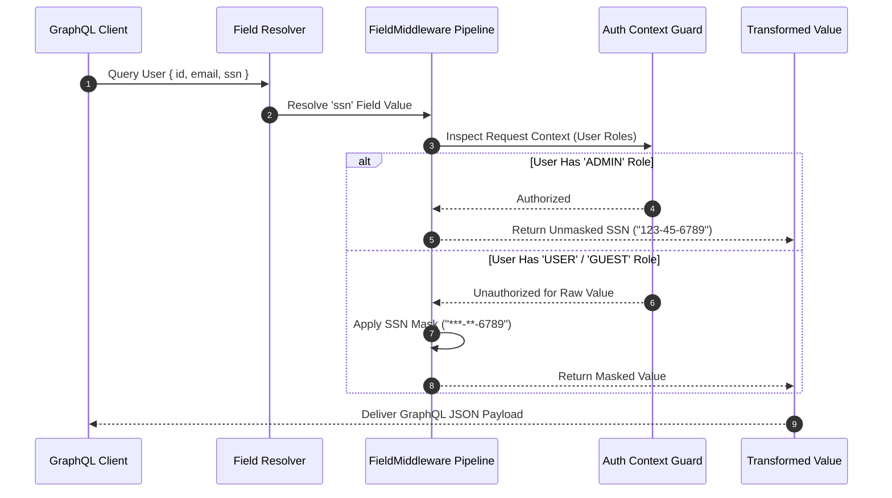

# GraphQL Field Middleware & Dynamic Property Transformers

The `@nestjs-yalc/field-middleware` package provides fine-grained property-level access control, dynamic field encryption, value maskers, and runtime formatting transformers for GraphQL schemas and REST DTO entities.

---

## 1. What It Is & Architectural Purpose

In GraphQL APIs and REST services, security and privacy requirements frequently demand hiding or transforming specific entity fields based on user permissions or compliance mandates (e.g., masking credit card numbers, masking email addresses for non-admins, decrypting PII data on read, or applying localized currency formatting).

`@nestjs-yalc/field-middleware` injects field middleware hooks into the NestJS execution context. It allows developers to attach declarative decorators (`@FieldMiddleware(...)`, `@MaskField()`, `@EncryptField()`) directly to GraphQL ObjectType fields or class DTO properties without polluting business domain services with inline security checks.

```
┌────────────────────────────────────────────────────────────────────────┐
│                        GraphQL Query / DTO                             │
├────────────────────────────────────────────────────────────────────────┤
│  1. Incoming Request Context (User Role: 'GUEST')                      │
│  2. Resolving Field: 'user.email'                                      │
└──────────────────────────────────┬─────────────────────────────────────┘
                                   │
                                   ▼
┌────────────────────────────────────────────────────────────────────────┐
│                      YalcFieldMiddleware Engine                        │
├────────────────────────────────────────────────────────────────────────┤
│  Evaluate Field Decorators (@MaskField({ type: 'EMAIL' }))             │
│  User is GUEST -> Transform 'john.doe@example.com'                     │
│               -> Result: 'j***e@example.com'                           │
└──────────────────────────────────┬─────────────────────────────────────┘
                                   │
                                   ▼
┌────────────────────────────────────────────────────────────────────────┐
│                   Masked GraphQL / JSON Output                         │
└────────────────────────────────────────────────────────────────────────┘
```

---

## 2. What It Does & Key Capabilities

- **Declarative Field Protection**: Attach middleware rules to fields using NestJS decorators.
- **Role-Based Property Masking**: Dynamically mask Sensitive Data (PII, SSN, Credit Cards) depending on the requestor's JWT roles/permissions.
- **Property-Level Encryption**: Transparently decrypt AES-256 encrypted database columns during GraphQL object resolution.
- **Computed Value Formatting**: Apply localized date, currency, or string case transformations dynamically on read operations.

---

## 3. How It Works Under the Hood

### Execution Flow Sequence



---

## 4. Why It Was Designed This Way

| Feature | Standard Manual Field Checks | @nestjs-yalc/field-middleware |
| :--- | :--- | :--- |
| **Separation of Concerns** | Controllers/Services littered with `if (role === 'GUEST') mask()` logic. | Zero business service clutter; declarative `@Field()` decorators. |
| **GraphQL Parity** | Requires writing custom GraphQL field directives by hand. | Native NestJS field middleware integration with standard context. |
| **Consistency** | Risk of forgetting field masks in newly created API routes. | Centralized middleware pipeline guarantees compliance rules. |

---

## 5. Practical Usage Guide & Extended Code Examples

### 5.1 Masking Sensitive PII Fields in GraphQL

```typescript
import { Field, ObjectType } from '@nestjs/graphql';
import { MaskField, FieldMiddleware } from '@nestjs-yalc/field-middleware';

@ObjectType()
export class UserProfileType {
  @Field()
  id: string;

  @Field()
  @MaskField({ type: 'EMAIL', allowedRoles: ['ADMIN', 'SUPERUSER'] })
  email: string;

  @Field()
  @MaskField({ type: 'SSN', allowedRoles: ['COMPLIANCE_OFFICER'] })
  ssn: string;
}
```

### 5.2 Creating Custom Field Middleware Transformers

```typescript
import { FieldMiddleware, MiddlewareContext, NextFn } from '@nestjs-yalc/field-middleware';

export const CurrencyFormatterMiddleware: FieldMiddleware = async (
  ctx: MiddlewareContext,
  next: NextFn,
) => {
  const value = await next();
  if (typeof value !== 'number') return value;

  const userLocale = ctx.context.req?.headers['accept-language'] || 'en-US';
  return new Intl.NumberFormat(userLocale, { style: 'currency', currency: 'USD' }).format(value);
};
```

---

## 6. Anti-Patterns: How NOT to Use It

> [!CAUTION]
> **Anti-Pattern 1: Performing Heavy Async I/O in Field Middleware**
> Field middleware runs for *every resolved property instance* in a GraphQL query array. Executing database queries inside field middleware causes N+1 performance bottlenecks. Use DataLoaders for async field enrichment.

---

## 7. Pro-Tips & Best Practices

> [!TIP]
> **Pro-Tip 1: Combining with NestJS Guards**
> Use Field Middleware for property-level transformation while keeping NestJS Guards responsible for overall endpoint routing access.
