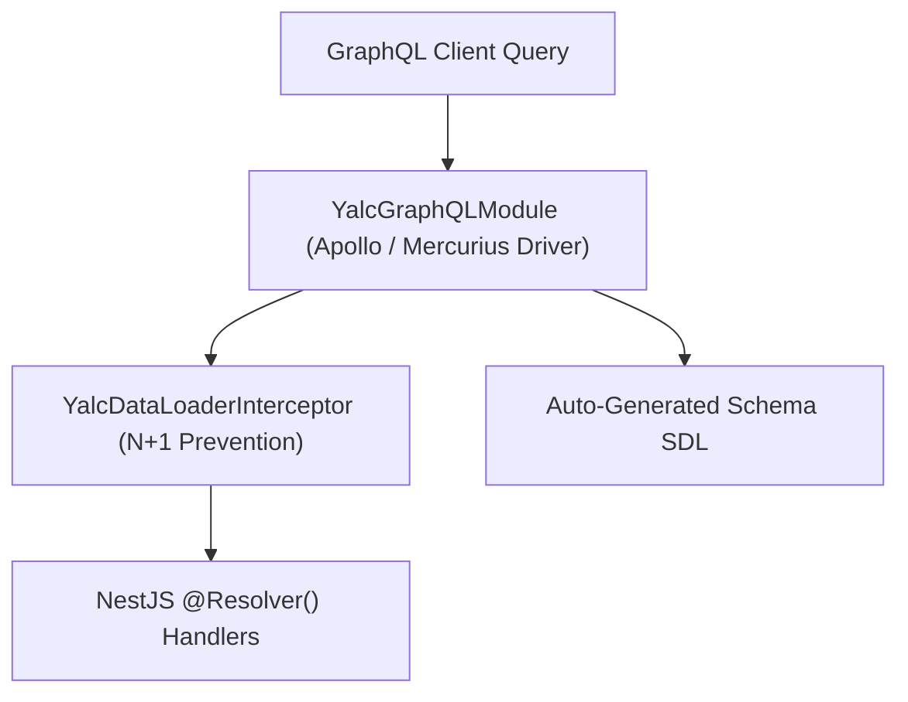

# 🔮 GraphQL Federation & Server Module (`@nest-yalc-2/graphql`)

`@nest-yalc-2/graphql` provides dynamic GraphQL server configuration for NestJS 11+, supporting both **Apollo Server** and **Fastify Mercurius**, Apollo Federation v2 schema stitching, custom scalar registration, and field-level execution guardrails.

---

## 🌟 Key Features

- **Dual Engine Drivers**: Easily switch between `apollo` and `mercurius` (Fastify) drivers.
- **Apollo Federation v2 Support**: Seamless sub-graph registration for GraphQL federated gateway architectures.
- **Automated Schema Generation**: Auto-generates GraphQL SDL schema files (`schema.gql`) directly from TypeScript decorators.
- **Custom Scalars**: Out-of-the-box registration for `DateTime`, `JSON`, `UUID`, and `JSONObject` scalars.

---

## 🔬 Internal Architecture & Execution Mechanics



---

## 📊 Architectural Comparison: `@nest-yalc-2/graphql` vs Default NestJS GraphQL

| Feature / Dimension | 🔮 `@nest-yalc-2/graphql` | 🐢 Default NestJS GraphQL Module |
|---|---|---|
| **Mercurius Fastify Engine** | **Supported with Zero Configuration** | Requires Complex Manual Setup |
| **DataLoader Integration** | **Native Interceptor Integration** | Manual Loader Context Creation |
| **Apollo Federation v2** | **Pre-Configured Subgraph Directives** | Manual Directive Registration |

---

## 🚀 Practical Usage & Production Code Examples

### 1. Registering GraphQL Module in `AppModule`

```typescript
import { Module } from '@nestjs/common';
import { YalcGraphQLModule } from '@nest-yalc-2/graphql';
import { join } from 'path';

@Module({
  imports: [
    YalcGraphQLModule.forRoot({
      driver: 'apollo', // 'apollo' or 'mercurius'
      autoSchemaFile: join(process.cwd(), 'src/schema.gql'),
      sortSchema: true,
      playground: process.env.NODE_ENV !== 'production',
      federation: {
        version: 2,
      },
    }),
  ],
})
export class AppModule {}
```

### 2. Defining GraphQL Resolver

```typescript
import { Resolver, Query, Mutation, Args, ID } from '@nestjs/graphql';
import { Product } from './product.entity';

@Resolver(() => Product)
export class ProductResolver {

  @Query(() => Product, { name: 'product' })
  async getProduct(@Args('id', { type: () => ID }) id: string): Promise<Product> {
    return { id, sku: 'PROD-100', name: 'Enterprise Laptop', price: 1299.99, createdAt: new Date() };
  }
}
```

---

## ⚠️ Common Pitfalls & Anti-Patterns

> [!CAUTION]
> **Enabling GraphQL Playground in Production**: Never leave `playground: true` enabled in production environments. It exposes your GraphQL schema introspection to public attackers.

---

## 💡 Best Practices

> [!TIP]
> **Mercurius Driver for Fastify**: Use `driver: 'mercurius'` when running on Fastify for maximum GraphQL query parsing performance and native subscription support over WebSockets.
