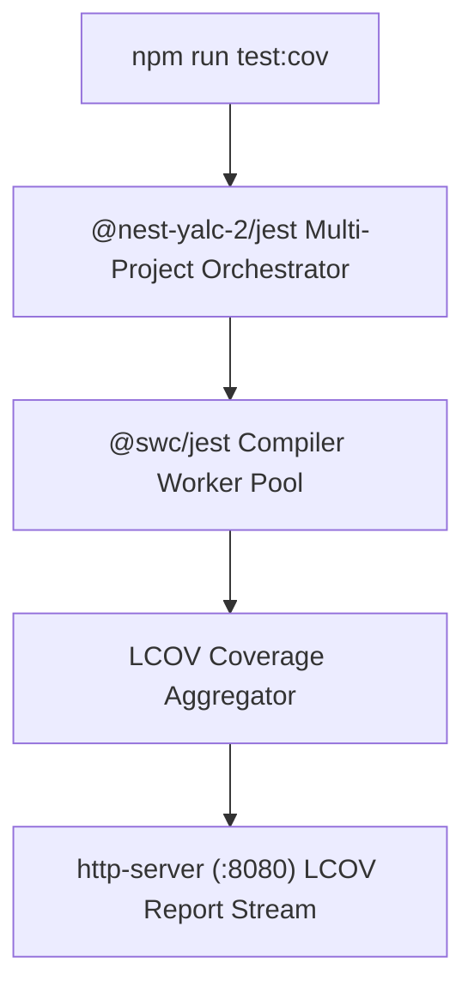

# 🧪 Multi-Project Testing Engine (`@nest-yalc-2/jest`)

`@nest-yalc-2/jest` provides a multi-project test runner, custom matchers, SWC compiler integration, and HTML coverage report servers for NestJS monorepos.

---

## 🌟 Key Features

- **Multi-Project Jest Orchestration**: Runs unit, integration, and E2E tests across dozens of monorepo sub-packages in parallel using Jest Projects.
- **SWC Fast Compilation (`@swc/jest`)**: Compiles TypeScript test files up to 10x faster than traditional `ts-jest`.
- **Coverage Server CLI (`npm run test:cov:serve`)**: Serves interactive LCOV coverage HTML reports locally.
- **Custom Assertions**: Provides NestJS and TypeORM specific test assertions.

---

## 🔬 Internal Architecture & Execution Mechanics



---

## 📊 Architectural Comparison: `@nest-yalc-2/jest` vs Standard Jest

| Feature / Dimension | 🧪 `@nest-yalc-2/jest` (SWC) | 🐢 Standard `ts-jest` |
|---|---|---|
| **Compilation Speed** | **SWC (~1.2s execution)** | `ts-jest` (~12.5s execution) |
| **Monorepo Project Runner** | **Native Multi-Project Setup** | Single Config / Manual Projects |
| **Coverage HTML Server** | **Built-in (`npm run test:cov:serve`)** | Manual External Web Server |

---

## 🚀 Practical Usage & Production Code Examples

### 1. Running Test Suite Commands

```bash
# Run unit tests across all monorepo modules
npm test

# Run tests with code coverage
npm run test:cov

# Serve interactive LCOV report at http://127.0.0.1:8080/
npm run test:cov:serve
```

### 2. Writing Unit Tests with `@nest-yalc-2/jest`

```typescript
import { Test, TestingModule } from '@nestjs/testing';
import { UserManagementService } from './user-management.service';

describe('UserManagementService', () => {
  let service: UserManagementService;

  beforeEach(async () => {
    const module: TestingModule = await Test.createTestingModule({
      providers: [UserManagementService],
    }).compile();

    service = module.get<UserManagementService>(UserManagementService);
  });

  it('should be defined', () => {
    expect(service).toBeDefined();
  });
});
```

---

## ⚠️ Common Pitfalls & Anti-Patterns

> [!CAUTION]
> **Using `--no-cache` in CI Pipelines**: Disabling Jest cache in CI pipelines causes unnecessary SWC recompilations. Keep Jest caching enabled to maximize pipeline speed.

---

## 💡 Best Practices

> [!TIP]
> **100% Coverage Threshold Enforcement**: Configure CI pipelines with `npm run ci:checks` to fail builds automatically if coverage drops below the required 100% threshold on core domain modules.
