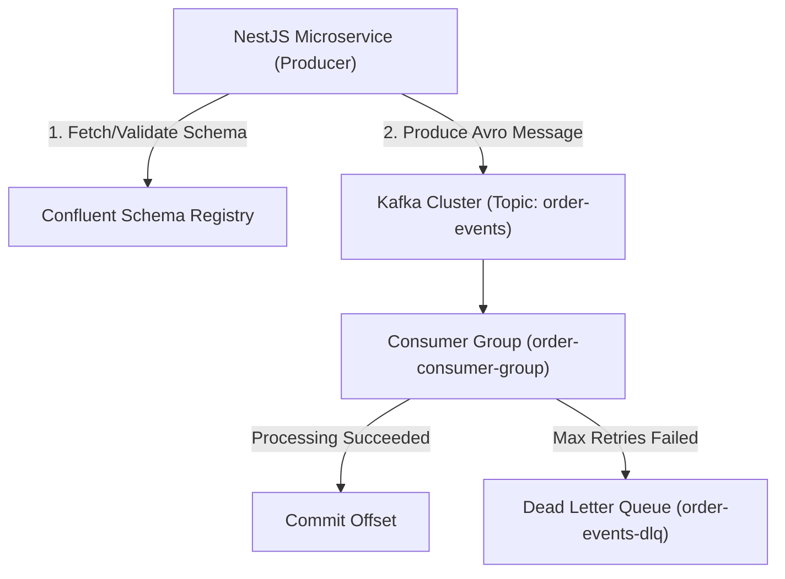

# 📬 KafkaJS & Schema Registry Integration (`@nest-yalc-2/kafka`)

`@nest-yalc-2/kafka` provides production-grade event streaming for NestJS 11+. It wraps **KafkaJS** and `@kafkajs/confluent-schema-registry`, enabling strongly-typed, schema-validated message producing and consuming across distributed microservices.

---

## 🌟 Key Features

- **Confluent Schema Registry Support**: Automatically serializes and deserializes message payloads using Avro, JSON Schema, or Protobuf schemas stored in Confluent Schema Registry.
- **Consumer Group Management**: Auto-rebalancing consumer group runners with exponential backoff retries and Dead Letter Queue (DLQ) routing.
- **Producer Connection Pool**: High-performance idempotent Kafka producer with message batching and snappy/gzip compression.
- **Trace Correlation Header Injection**: Automatically attaches `X-Request-Id` and OpenTelemetry `traceparent` headers into Kafka message headers.

---

## 🔬 Internal Architecture & Execution Mechanics



---

## 📊 Architectural Comparison: `@nest-yalc-2/kafka` vs Standard NestJS Microservices

| Feature / Dimension | 📬 `@nest-yalc-2/kafka` | 🐢 NestJS Microservice Kafka Transport |
|---|---|---|
| **Confluent Schema Registry** | **Native Avro / JSON Schema Validation** | Not Supported (Raw Unvalidated JSON) |
| **Dead Letter Queue (DLQ)** | **Automated DLQ Router on Failures** | Manual Error Catching & Routing |
| **Trace Correlation** | **Automatic W3C Trace Parent Header Injection** | Manual Header Parsing |

---

## 🚀 Practical Usage & Production Code Examples

### 1. Registering Kafka Module in `AppModule`

```typescript
import { Module } from '@nestjs/common';
import { YalcKafkaModule } from '@nest-yalc-2/kafka';

@Module({
  imports: [
    YalcKafkaModule.forRoot({
      clientId: 'order-service',
      brokers: (process.env.KAFKA_BROKERS || 'localhost:9092').split(','),
      schemaRegistry: {
        host: process.env.SCHEMA_REGISTRY_URL || 'http://localhost:8081',
      },
      consumer: {
        groupId: 'order-processor-group',
      },
    }),
  ],
})
export class AppModule {}
```

### 2. Producing Schema-Validated Events

```typescript
import { Injectable } from '@nestjs/common';
import { YalcKafkaProducer } from '@nest-yalc-2/kafka';

@Injectable()
export class OrderEventPublisher {
  constructor(private readonly kafkaProducer: YalcKafkaProducer) {}

  async publishOrderCreated(orderId: string, amount: number): Promise<void> {
    await this.kafkaProducer.emit('order-events', {
      key: orderId,
      value: {
        orderId,
        amount,
        status: 'CREATED',
        timestamp: Date.now(),
      },
      schemaName: 'OrderCreatedEventSchema',
    });
  }
}
```

---

## ⚠️ Common Pitfalls & Anti-Patterns

> [!CAUTION]
> **Blocking the Kafka Consumer Event Loop**: Executing heavy synchronous computations or un-batched database queries inside a Kafka message handler will delay heartbeat responses (`session.timeout.ms`), causing Kafka to consider the consumer dead and trigger cascading rebalances.

---

## 💡 Best Practices

> [!TIP]
> **Idempotent Consumers**: Ensure consumer handlers check if an event ID has already been processed using Redis or an audit table to handle potential duplicate message deliveries gracefully.
