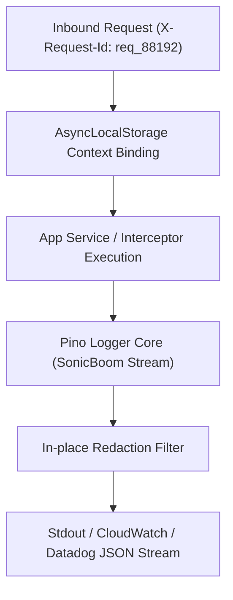

# 📝 Contextual Pino Logging Module (`@nest-yalc-2/logger`)

`@nest-yalc-2/logger` provides a high-performance, structured Pino logging integration for NestJS 11+. It automatically correlates HTTP request IDs (`X-Request-Id`) across asynchronous execution contexts using Node.js `AsyncLocalStorage`, redacting sensitive payload data for GDPR and PCI-DSS compliance.

---

## 🌟 Key Features

- **Asynchronous Context Correlation**: Automatically injects request trace IDs into all log statements emitted during an HTTP or GraphQL request lifecycle.
- **High-Performance Pino Engine**: Up to 5x faster than standard NestJS console loggers or Winston.
- **Automatic Sensitive Data Masking**: Configurable redaction rules for passwords, credit card numbers, authorization tokens, and API secrets.
- **NestJS Logger Interface Replacement**: Replaces NestJS's default `LoggerService` globally across all modules.

---

## 🔬 Internal Architecture & Mechanics



### Trace Correlation Pipeline
1. **Middleware Injection**: When an HTTP request enters the application, `YalcLoggerMiddleware` checks for an existing `X-Request-Id` header or generates a cryptographically random UUID v4 string.
2. **Context Preservation**: The request ID is stored in Node.js `AsyncLocalStorage`. Any log call invoked inside controller methods, services, or repositories automatically retrieves and appends `requestId: req_88192` to the output JSON payload.

---

## 📊 Architectural Comparison: `@nest-yalc-2/logger` vs NestJS Default Logger

| Metric / Dimension | 📝 `@nest-yalc-2/logger` (Pino) | 🐢 NestJS Default `ConsoleLogger` |
|---|---|---|
| **Logging Format** | **Structured JSON Output** | Unstructured Formatted Plaintext |
| **Async Context Correlation** | **Native `AsyncLocalStorage` (`X-Request-Id`)** | Manual Parameter Passing |
| **Throughput (Logs/sec)** | **> 35,000 logs/sec** | ~7,000 logs/sec |
| **Data Masking** | **Native Redaction Rules** | Manual Sanitization Code |

---

## 🚀 Practical Usage & Production Code Examples

### 1. Registering Logger Module in `AppModule`

```typescript
import { Module } from '@nestjs/common';
import { YalcLoggerModule } from '@nest-yalc-2/logger';

@Module({
  imports: [
    YalcLoggerModule.forRoot({
      pinoOptions: {
        level: process.env.LOG_LEVEL || 'info',
        redact: [
          'password',
          'authorization',
          '*.secret',
          'creditCard.number',
        ],
      },
    }),
  ],
})
export class AppModule {}
```

### 2. Injecting and Using Logger inside Services

```typescript
import { Injectable } from '@nestjs/common';
import { YalcLoggerService } from '@nest-yalc-2/logger';

@Injectable()
export class PaymentProcessingService {
  constructor(private readonly logger: YalcLoggerService) {
    this.logger.setContext(PaymentProcessingService.name);
  }

  async processPayment(orderId: string, amount: number, paymentDetails: any): Promise<void> {
    // Log statement automatically includes X-Request-Id and masks paymentDetails.creditCard
    this.logger.info('Initiating payment processing for order', {
      orderId,
      amount,
      paymentDetails, // Automatically redacted based on pinoOptions
    });

    try {
      // Execute payment gateway call
      this.logger.debug('Payment gateway call successful', { orderId });
    } catch (error: any) {
      this.logger.error('Payment processing failed', error.stack, { orderId });
      throw error;
    }
  }
}
```

---

## ⚠️ Common Pitfalls & Anti-Patterns

> [!CAUTION]
> **Logging Raw Request / Response Objects**: Avoid calling `this.logger.info(req)` directly. Logging raw Node.js HTTP request streams can cause circular reference errors or crash process memory during stringification.

---

## 💡 Best Practices

> [!TIP]
> **Production Log Aggregation**: In Kubernetes or Docker environments, pipe stdout logs to FluentBit or Datadog Agent. Pino's native JSON output requires zero extra parsing CPU cycles on log aggregators.
