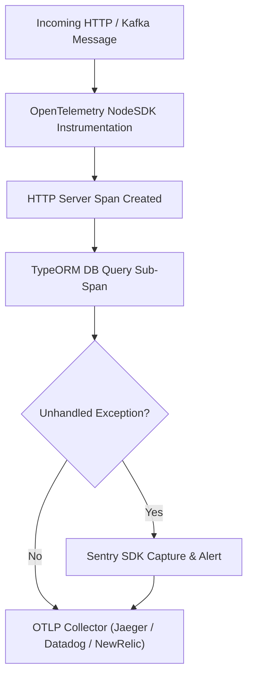

# 🔭 OpenTelemetry & Sentry Observability (`@nest-yalc-2/observability`)

`@nest-yalc-2/observability` provides enterprise distributed tracing, metrics collection, and exception tracking for NestJS 11+. It integrates **OpenTelemetry OTLP exporters**, **Prometheus metric collectors**, and **Sentry error reporting** into a unified NestJS module.

---

## 🌟 Key Features

- **OpenTelemetry OTLP Tracing**: Emits distributed trace spans for HTTP requests, TypeORM SQL queries, Redis calls, and Kafka messages.
- **Sentry Exception Reporter**: Automatically captures unhandled exceptions, attaching trace IDs, user context, and environment breadcrumbs.
- **Prometheus Metrics Exporter**: Exposes a `/metrics` endpoint with request duration histograms, active connection counts, and memory metrics.
- **Trace Parent Propagation**: Propagates W3C Trace Context headers (`traceparent`, `tracestate`) across HTTP microservices and Kafka message headers.

---

## 🔬 Internal Architecture & Mechanics



---

## 📊 Architectural Comparison: `@nest-yalc-2/observability` vs Manual Telemetry

| Feature / Dimension | 🔭 `@nest-yalc-2/observability` | 🐢 Manual Telemetry Setup |
|---|---|---|
| **Trace Span Auto-Instrumentation** | **HTTP, TypeORM, Redis, Kafka (Zero-Code)** | Manual Span Creation & Context Binding |
| **Sentry Error Correlation** | **Binds Sentry Events to W3C Trace IDs** | Isolated Uncorrelated Sentry Alerts |
| **W3C Trace Parent Propagation** | **Automatic Header Injection** | Manual Header Parsing & Formatting |

---

## 🚀 Practical Usage & Production Code Examples

### 1. Initializing Observability Module in `main.ts` & `AppModule`

```typescript
import { YalcObservabilityModule, initOpenTelemetrySDK } from '@nest-yalc-2/observability';
import { Module } from '@nestjs/common';

// Initialize OpenTelemetry SDK before NestJS bootstrap
initOpenTelemetrySDK({
  serviceName: 'order-service',
  otlpEndpoint: process.env.OTEL_EXPORTER_OTLP_ENDPOINT || 'http://otel-collector:4318/v1/traces',
});

@Module({
  imports: [
    YalcObservabilityModule.forRoot({
      serviceName: 'order-service',
      sentryDsn: process.env.SENTRY_DSN,
      enablePrometheusMetrics: true,
      metricsPath: '/metrics',
    }),
  ],
})
export class AppModule {}
```

### 2. Adding Custom Tracing Spans in Business Services

```typescript
import { Injectable } from '@nestjs/common';
import { YalcTrace } from '@nest-yalc-2/observability';

@Injectable()
export class OrderFulfillmentService {

  @YalcTrace('fulfill_order_workflow')
  async fulfillOrder(orderId: string): Promise<void> {
    // Custom trace span automatically created for this method execution
    console.log('Fulfilling order:', orderId);
  }
}
```

---

## ⚠️ Common Pitfalls & Anti-Patterns

> [!WARNING]
> **High Cardinality Metrics Labels**: Avoid adding high-cardinality values (such as user IDs or order UUIDs) as labels in Prometheus metrics. High cardinality labels overwhelm Prometheus memory indexing. Use trace attributes in OpenTelemetry instead.

---

## 💡 Best Practices

> [!TIP]
> **Jaeger & Grafana Integration**: Route OTLP trace exports to an OpenTelemetry Collector daemon, which forwards spans to Jaeger for distributed trace visualization and Grafana for latency dashboards.
