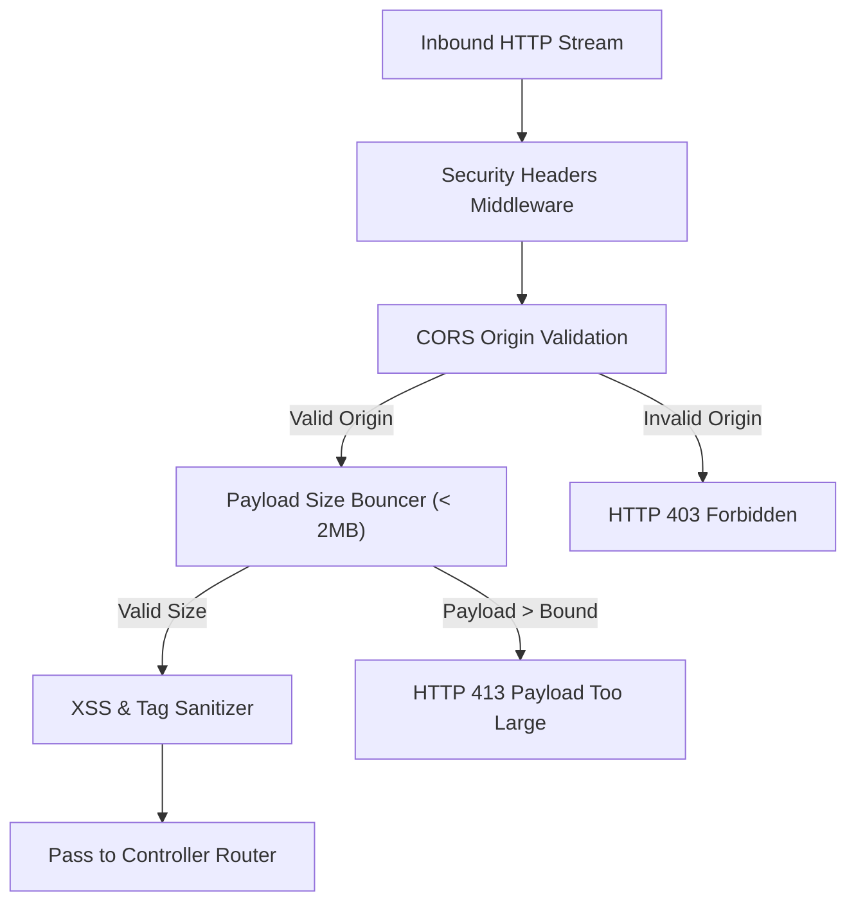

# 🛡️ Sentinel Security Middleware (`@nest-yalc-2/sentinel`)

`@nest-yalc-2/sentinel` is the security middleware and policy enforcement module for NestJS 11+. It enforces OWASP recommended HTTP security headers, CORS origin policies, request payload size bounds, and input sanitization across all REST and GraphQL endpoints.

---

## 🌟 Key Features

- **OWASP Security Headers**: Injects mandatory security headers (`Strict-Transport-Security`, `Content-Security-Policy`, `X-Frame-Options: DENY`, `X-Content-Type-Options: nosniff`, `Referrer-Policy`).
- **Tech Leak Stripper**: Strips technological disclosure headers (`X-Powered-By: Express`, `Server`) to prevent server reconnaissance.
- **Strict CORS Policy Enforcer**: Validates request origins against dynamically loaded allowed domain patterns.
- **Payload Bound Validator**: Rejects oversized JSON/GraphQL request payloads to prevent Denial of Service (DoS) memory exhaustion.

---

## 🔬 Internal Architecture & Execution Mechanics



---

## 📊 Architectural Comparison: `@nest-yalc-2/sentinel` vs Helmet.js

| Feature / Dimension | 🛡️ `@nest-yalc-2/sentinel` | ⛑️ Helmet.js (Basic) |
|---|---|---|
| **Tech Leak Stripping** | **Automated (Express & Fastify)** | Manual `app.disable('x-powered-by')` |
| **Payload Size Bouncer** | **Built-in Dynamic Bouncer** | Requires Body-Parser Middleware Config |
| **NestJS Lifecycle Integration** | **Native Dynamic Module (`forRoot`)** | Raw Middleware Mounting |

---

## 🚀 Practical Usage & Production Code Examples

### 1. Registering Sentinel Security Module in `AppModule`

```typescript
import { Module } from '@nestjs/common';
import { YalcSentinelModule } from '@nest-yalc-2/sentinel';

@Module({
  imports: [
    YalcSentinelModule.forRoot({
      enforceSecurityHeaders: true,
      contentSecurityPolicy: {
        defaultSrc: ["'self'"],
        scriptSrc: ["'self'", "'unsafe-inline'"],
        styleSrc: ["'self'", "'unsafe-inline'"],
      },
      allowedCorsOrigins: [
        'https://app.ferrox.dev',
        'https://admin.ferrox.dev',
      ],
      maxPayloadSizeBytes: 2 * 1024 * 1024, // 2MB max payload
    }),
  ],
})
export class AppModule {}
```

---

## ⚠️ Common Pitfalls & Anti-Patterns

> [!CAUTION]
> **Using Wildcard CORS (`origin: '*'`) with Credentials**: Allowing wildcard origins (`*`) while enabling `credentials: true` breaks browser security policies and leaves your API vulnerable to Cross-Origin Request Forgery (CSRF). Always specify explicit origin domains.

---

## 💡 Best Practices

> [!TIP]
> **HSTS Preload**: Enable `Strict-Transport-Security` with `includeSubDomains` and `preload` directives in production to force browsers to interact with your domain exclusively over HTTPS.
