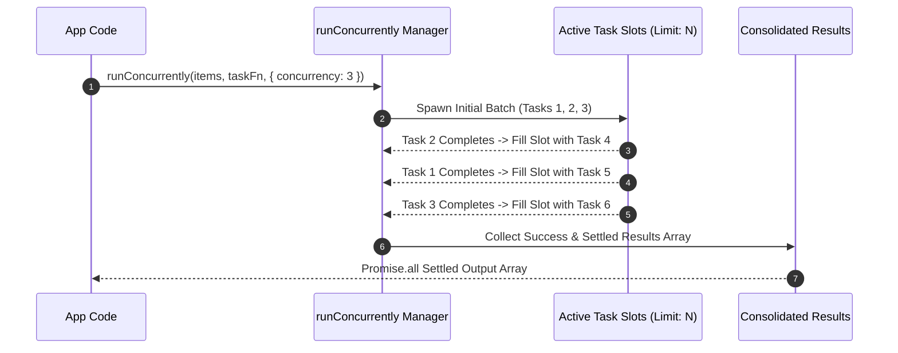

# Core Utilities, Helpers & Object Manipulation

The `@nestjs-yalc/utils` package is the core utility toolkit for the NestJS-Yalc ecosystem. It provides high-performance, type-safe utility functions for object manipulation, array operations, concurrent async processing, string transformations, class reflection helpers, and cryptographic hashing.

---

## 1. What It Is & Architectural Purpose

Node.js enterprise applications frequently require low-level helper routines: deep merging configuration objects, concurrency-throttled array mapping, sanitizing circular references, generating deterministic hash signatures, or manipulating TypeScript types at runtime. Using uncontrolled third-party libraries (or duplicating un-tested snippets across services) introduces security vulnerabilities and code instability.

`@nestjs-yalc/utils` aggregates optimized, zero-dependency, rigorously unit-tested utility routines specifically tailored for NestJS microservice environments.

```
                               ┌─────────────────────────────┐
                               │     @nestjs-yalc/utils      │
                               └──────────────┬──────────────┘
                                              │
         ┌───────────────────────────┬────────┴───────────────────┬───────────────────────────┐
         │                           │                            │                           │
         ▼                           ▼                            ▼                           ▼
┌──────────────────┐       ┌──────────────────┐         ┌──────────────────┐        ┌──────────────────┐
│ Object & Deep    │       │ Async Queue &    │         │ Type & Class     │        │ Crypto & Hash    │
│ Manipulation     │       │ Concurrency      │         │ Reflection       │        │ Sanitizers       │
└──────────────────┘       └──────────────────┘         └──────────────────┘        └──────────────────┘
```

---

## 2. What It Does & Key Capabilities

- **`runConcurrently()`**: Executes asynchronous task queues with strict concurrency concurrency limits and error collection strategy.
- **`deepMerge()` & `deepClone()`**: Performs immutable, memory-efficient deep object merging and copying without prototype pollution vulnerabilities.
- **`sanitizeObject()`**: Strips sensitive properties (`password`, `secret`, `creditCard`), circular references, and null/undefined values recursively.
- **Class & Reflection Helpers**: Utility methods to inspect NestJS metadata keys, extract class property names, and manipulate decorators at runtime.
- **Deterministic Hashing**: Fast SHA-256 and MD5 hashing helpers for object checksum comparison and caching keys.

---

## 3. How It Works Under the Hood

### Concurrent Task Queue Execution Mechanics



---

## 4. Why It Was Designed This Way

| Feature | Standard Lodash / Native JS | @nestjs-yalc/utils |
| :--- | :--- | :--- |
| **Security** | Standard `lodash.merge` is vulnerable to prototype pollution. | Hardened against `__proto__` and `constructor` prototype manipulation. |
| **Concurrency** | `Promise.all` executes all items simultaneously, overloading DB pools. | Controlled concurrency limits (e.g., max 10 concurrent requests). |
| **Type Safety** | Loose `any` typing in generic helpers. | Fully typed TS generics preserving object schema inferencing. |

---

## 5. Practical Usage Guide & Extended Code Examples

### 5.1 Controlled Async Queue Worker (`runConcurrently`)

```typescript
import { runConcurrently } from '@nestjs-yalc/utils';

interface SyncTask { id: string; payload: string; }

async function processBatch(tasks: SyncTask[]) {
  const results = await runConcurrently(
    tasks,
    async (task) => {
      // Async database or external HTTP operation
      return await updateExternalResource(task.id, task.payload);
    },
    { concurrency: 5, stopOnError: false }
  );

  console.log(`Processed ${results.length} tasks concurrently.`);
}
```

### 5.2 Deep Object Sanitization & Hashing

```typescript
import { sanitizeObject, hashObject } from '@nestjs-yalc/utils';

const rawUserData = {
  id: 'usr_100',
  username: 'johndoe',
  passwordHash: 'secret_hash_123',
  creditCard: { number: '4111-xxxx-xxxx-1111', cvv: '123' },
  address: null,
};

// Strips sensitive fields recursively
const safeObject = sanitizeObject(rawUserData, ['passwordHash', 'cvv']);

// Generates deterministic hash signature for cache keying
const cacheKey = hashObject(safeObject);
```

---

## 6. Anti-Patterns: How NOT to Use It

> [!CAUTION]
> **Anti-Pattern 1: Unbounded Concurrency**
> Setting `concurrency: 1000` in `runConcurrently()` defeats the purpose of queue throttling and will exhaust Node.js socket pools or TypeORM database connection limits.

---

## 7. Pro-Tips & Best Practices

> [!TIP]
> **Pro-Tip 1: Immutable Deep Merging**
> Use `deepMerge(target, source)` when building composite configuration objects in microservice factories to guarantee nested properties are merged cleanly without mutating original templates.
