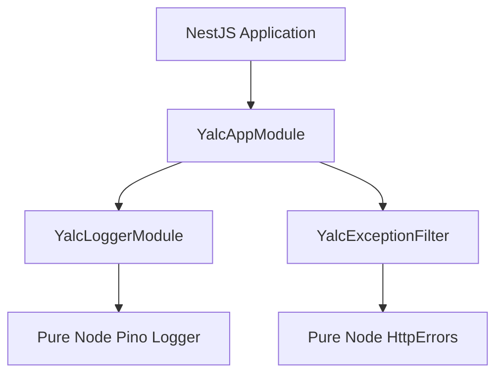

# 🚀 NestJS-YALC Overview

## 💡 1. What It Is & Architectural Purpose

**NestJS-YALC** (Yet Another Library Collection) is an enterprise-grade library suite designed specifically for NestJS 11+ and TypeScript 6+. It extends the core NestJS framework with a collection of pre-built, production-ready modules that address the most common and complex challenges in enterprise backend development. 

In the Ferrox Architecture, it serves as the primary "glue" layer, wrapping the pure Node.js utilities from `[@node-yalc](../node-yalc/overview.md)` into robust NestJS Dependency Injection providers.

---

## ⚙️ 2. Comprehensive Taxonomy & Key Features

NestJS-YALC provides an opinionated, modular infrastructure mapped across multiple layers:

- **Automated CRUD (`@nest-yalc-2/crud-gen`)**: Generates TypeORM REST endpoints and GraphQL resolvers.
- **GraphQL DataLoader (`@nest-yalc-2/data-loader`)**: Solves the N+1 query problem through automated field batching.
- **Observability (`@nest-yalc-2/observability`)**: Seamless OpenTelemetry tracing and Prometheus metrics exporter.
- **Database Enhancements (`@nest-yalc-2/database`)**: TypeORM database connection factories and transactional runners.
- **Event Driven (`@nest-yalc-2/kafka`)**: KafkaJS client integration with Schema Registry.
- **Security Sentinel (`@nest-yalc-2/sentinel`)**: Security middleware enforcing HTTP headers and CORS policies.

---

## 🔬 3. How It Works Under the Hood

The architecture leverages Git Submodules to import `node-yalc` as a foundational base. NestJS-YALC then wraps these pure primitives in `@Injectable()` decorators, interceptors, and dynamic modules.



---

## 🧠 4. Why It Was Designed This Way (Rationale)

While NestJS provides an excellent architectural foundation, enterprise applications often require significant boilerplate to integrate advanced logging, tracing, auto-generated APIs, and Kafka messaging. NestJS-YALC bridges this gap. By encapsulating every feature in a dedicated NestJS Module, you only import what you need, keeping your memory footprint minimal.

---

## 🚀 5. Practical Usage Guide & Extended Code Examples

To begin using NestJS-YALC, import the core lifecycle and logger modules into your root `AppModule`:

```typescript
import { Module } from '@nestjs/common';
import { YalcAppModule } from '@nest-yalc-2/app';
import { YalcLoggerModule } from '@nest-yalc-2/logger';

@Module({
  imports: [
    YalcAppModule.forRoot(),
    YalcLoggerModule.forRoot({
      pinoOptions: { level: 'info' }
    }),
  ],
})
export class AppModule {}
```

---

## ⚠️ 6. Anti-Patterns: How NOT to Use It

> [!CAUTION]
> **Anti-Pattern 1: Monolithic Imports**
> Do not import all `@nest-yalc-2/*` packages into a single service if they are not needed. Rely on fine-grained imports (e.g., importing only the logger or only the database module) to prevent unused dependencies from bloating the application context.

---

## 💡 7. Pro-Tips & Best Practices

> [!TIP]
> **Pro-Tip 1: Cross-Referencing Documentation**
> For details on how the underlying error handling works, refer to the `[Node-YALC Errors](../../node-yalc/fundamentals/errors.md)` documentation. For database-specific integrations, check the `[Database Documentation](../databases/database.md)`.
