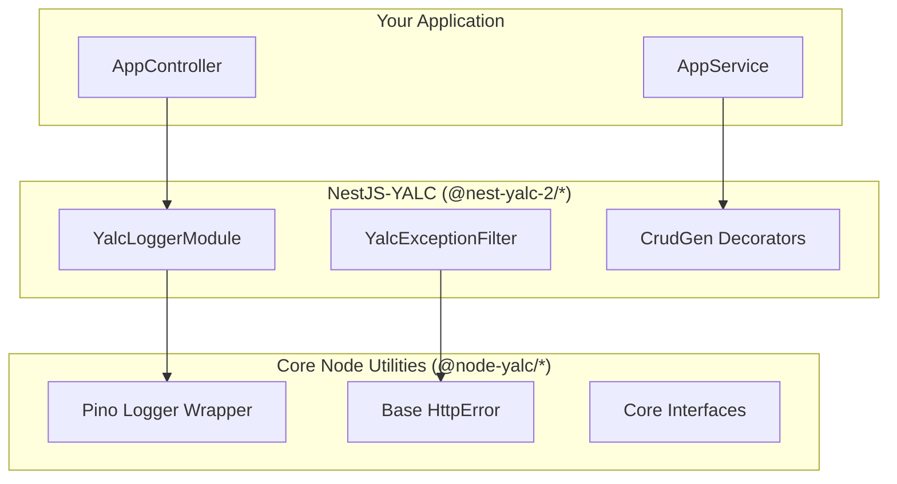

# 🏗️ Architecture

## 💡 1. What It Is & Architectural Purpose

NestJS-YALC is structured as a modular monorepo, providing an architectural bridge between raw Node.js utilities and the NestJS dependency injection system. It adheres strictly to the Ferrox 7-Layer Architecture, ensuring that business logic remains decoupled from the transport and framework layers.

---

## ⚙️ 2. Comprehensive Taxonomy & Key Features

NestJS-YALC modules can be categorized into three main layers:

- **Infrastructure Layer**: Modules that deal with the underlying system and external boundaries (`@nest-yalc-2/logger`, `@nest-yalc-2/observability`, `@nest-yalc-2/errors`, `@nest-yalc-2/sentinel`).
- **Data & Persistence Layer**: Modules that handle data storage, retrieval, and mapping (`@nest-yalc-2/database`, `@nest-yalc-2/crud-gen`, `@nest-yalc-2/data-loader`).
- **Communication Layer**: Modules that handle inter-service communication and APIs (`@nest-yalc-2/graphql`, `@nest-yalc-2/kafka`, `@nest-yalc-2/event-manager`).

---

## 🔬 3. How It Works Under the Hood

### The Bridge Pattern

At its core, NestJS-YALC acts as an adapter layer over the pure `[@node-yalc](../../node-yalc/overview.md)` foundation.

- **Providers (`@Injectable`)**: Core utilities are exposed as injectable services.
- **Dynamic Modules**: Configurations are passed via `.forRoot()` or `.forRootAsync()` patterns.
- **Interceptors & Filters**: Generic error types are caught and mapped to proper HTTP/GraphQL responses via NestJS Exception Filters.



---

## 🧠 4. Why It Was Designed This Way (Rationale)

The monorepo relies on standard npm/yarn workspaces to manage the internal dependencies between `@nest-yalc-2/` packages. When building an application, relying on the specific packages rather than a single monolithic library keeps the deployment bundle size minimal and ensures strict boundary enforcement between domains.

---

## 🚀 5. Practical Usage Guide & Extended Code Examples

When architecting a new microservice, you should compose your application root by selecting the necessary infrastructure modules. 

```typescript
import { Module } from '@nestjs/common';
import { YalcDatabaseModule } from '@nest-yalc-2/database';
import { YalcLoggerModule } from '@nest-yalc-2/logger';
import { ConfigModule } from '@nestjs/config';

@Module({
  imports: [
    ConfigModule.forRoot(),
    YalcLoggerModule.forRoot(),
    YalcDatabaseModule.forRootAsync({
      // Database configuration injected from environment
    }),
  ],
})
export class MicroserviceRootModule {}
```

---

## ⚠️ 6. Anti-Patterns: How NOT to Use It

> [!CAUTION]
> **Anti-Pattern 1: Bypassing the Bridge Layer**
> Do not attempt to instantiate pure `node-yalc` classes directly within a NestJS controller using the `new` keyword. Always use the NestJS Dependency Injection container provided by `@nest-yalc-2` to ensure proper lifecycle management.

---

## 💡 7. Pro-Tips & Best Practices

> [!TIP]
> **Pro-Tip 1: Refer to the Quickstart**
> To see a fully functioning bridge in action, consult the `[Quickstart Guide](./quickstart.md)` which provides a step-by-step tutorial on bootstrapping a new NestJS service with YALC.


---

## 🔗 Cross-References

To see how this module integrates with the rest of the Ferrox architecture, refer to the following documentation:

- [Database & TypeORM](../databases/database.md)
- [Event Manager](../../node-yalc/docs/architectures/event-manager.md)
- [GraphQL Transport Module](../transports/graphql.md)
- [Kafka Integration](../integrations/kafka.md)
- [Node-YALC Errors](../../node-yalc/docs/fundamentals/errors.md)
- [Observability & Logger](../observability/logger.md)
- [System Observability](../observability/observability.md)
